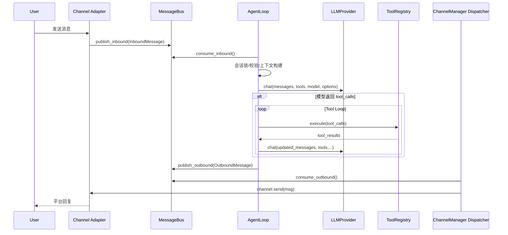

# ZeptoClaw / OpenClaw 风格核心业务链路设计文档

## 1. 文档目标

本文提炼这类 Agent 系统（OpenClaw / ZeptoClaw 同类）的核心业务逻辑，聚焦：

- 一个消息从 **Channel 进入** 到 **Channel 回复** 的完整链路
- 系统中的高层抽象（Trait）及职责边界
- 关键运行时机制：会话串行、工具循环、记忆注入、超时与降级
- 可演进的架构接口（便于多 Channel、多 Provider、多 Runtime 扩展）

---

## 2. 核心架构总览

系统可以看成三段解耦管道：

1. **Ingress（入站适配层）**  
   各种外部平台（Telegram / Discord / Webhook / WhatsApp...）统一适配为 `InboundMessage`。

2. **Core Agent（推理与编排层）**  
   AgentLoop 从消息总线消费入站，构建上下文、调用大模型、执行工具回路、生成最终响应。

3. **Egress（出站分发层）**  
   ChannelManager 从消息总线消费 `OutboundMessage`，按 channel 名路由并调用对应 channel 的 `send()`。

---

## 3. 高层 Trait 抽象（核心契约）

> 以下是核心抽象的“设计视图”（与当前代码一致或高度同构）。

### 3.1 Channel 抽象（平台适配器）

```rust
#[async_trait]
pub trait Channel: Send + Sync {
    fn name(&self) -> &str;
    async fn start(&mut self) -> Result<()>;
    async fn stop(&mut self) -> Result<()>;
    async fn send(&self, msg: OutboundMessage) -> Result<()>;
    fn is_running(&self) -> bool;
    fn is_allowed(&self, user_id: &str) -> bool;
}
```

**职责：**

- 入站：把平台消息转换成 `InboundMessage` 并发布到总线
- 出站：把 `OutboundMessage` 发送到平台 API
- 生命周期：连接、断线恢复、健康状态暴露
- 准入控制：allowlist / deny_by_default

---

### 3.2 MessageBus 抽象（双向异步总线）

```rust
pub struct MessageBus {
    // inbound: channel -> agent
    // outbound: agent -> channel
}
```

**关键接口：**

- `publish_inbound(msg)`
- `consume_inbound()`
- `publish_outbound(msg)`
- `consume_outbound()`

**设计价值：**

- 彻底解耦 channel 与 agent
- 支持多个生产者（多 channel）+ 单消费主循环（agent / dispatcher）
- 统一背压与缓冲策略

---

### 3.3 LLMProvider 抽象（模型后端）

```rust
#[async_trait]
pub trait LLMProvider: Send + Sync {
    fn name(&self) -> &str;
    fn default_model(&self) -> &str;
    async fn chat(
        &self,
        messages: Vec<Message>,
        tools: Vec<ToolDefinition>,
        model: Option<&str>,
        options: ChatOptions,
    ) -> Result<LLMResponse>;

    async fn chat_stream(
        &self,
        messages: Vec<Message>,
        tools: Vec<ToolDefinition>,
        model: Option<&str>,
        options: ChatOptions,
    ) -> Result<mpsc::Receiver<StreamEvent>>;
}
```

**职责：**

- 把统一消息格式映射到不同厂商协议（OpenAI/Anthropic/...）
- 支持工具调用格式与流式输出

---

### 3.4 Tool 抽象（可执行能力单元）

```rust
#[async_trait]
pub trait Tool: Send + Sync {
    fn name(&self) -> &str;
    fn description(&self) -> &str;
    fn parameters(&self) -> serde_json::Value;
    fn category(&self) -> ToolCategory;
    async fn execute(&self, args: Value, ctx: &ToolContext) -> Result<ToolOutput>;
}
```

**职责：**

- 提供可被 LLM 调用的外部能力（文件、shell、web、memory、mcp...）
- 通过 `ToolContext` 获取 channel/chat/workspace 等运行上下文
- 通过 `ToolOutput` 区分给 LLM 的结果与可直接发给用户的结果

---

### 3.5 AgentLoop 抽象（业务编排核心）

```rust
pub struct AgentLoop {
    provider: Arc<RwLock<Option<Arc<dyn LLMProvider>>>>,
    tools: Arc<RwLock<ToolRegistry>>,
    bus: Arc<MessageBus>,
    session_manager: Arc<SessionManager>,
    // ... budget / guard / safety / ltm / taint / metrics ...
}
```

**职责：**

- 消费入站消息
- 会话管理与上下文构建
- 调用 LLM + 工具循环
- 结果发布到 outbound
- 异常处理、限流、预算、审计、监控

---

## 4. 统一消息模型（系统边界对象）

### 4.1 InboundMessage（入站标准化）

核心字段：

- `channel`：来源渠道名
- `sender_id`：发送者标识
- `chat_id`：会话标识
- `content`：文本内容
- `media`：多媒体附件
- `session_key = "{channel}:{chat_id}"`：会话串行锁键
- `metadata`：路由和策略附加信息（如 `model_override`、`provider_override`、`telegram_thread_id`）

### 4.2 OutboundMessage（出站标准化）

核心字段：

- `channel`：目标渠道名
- `chat_id`：目标会话
- `content`：回复内容
- `reply_to`：可选回复引用
- `metadata`：平台路由 hint（如 thread/topic 信息）

---

## 5. 一条消息完整链路（主路径）

### 5.1 启动阶段（一次性）

1. Gateway 创建 `MessageBus`
2. 创建并启动 `ChannelManager`（启动所有 channel + 启动 outbound dispatcher）
3. 创建并启动 `AgentLoop`（消费 inbound 主循环）
4. 注册工具、Provider、Memory、Safety、Hooks、Metrics 等子系统

---

### 5.2 入站阶段（Channel -> Bus）

1. 某 channel 收到平台消息（Webhook 请求 / Telegram Update / Discord Gateway Event）
2. 做平台内校验（token、allowlist、消息类型过滤）
3. 映射为 `InboundMessage`
4. `bus.publish_inbound(inbound)`

---

### 5.3 Agent 处理阶段（Bus -> AgentLoop）

AgentLoop 主循环：

1. `consume_inbound()` 取消息
2. 前置校验
   - pairing（如启用设备配对）
   - 注入检测（特定不可信 channel 可阻断）
3. 会话并发控制
   - 基于 `session_key` 的锁保证**同会话串行**
   - 忙会话消息根据策略：`collect` 或 `followup` 入队
4. 调用 `process_message(msg)`（核心编排）

---

### 5.4 核心编排：`process_message`

#### A. 准备上下文

- 解析 provider/model override（来自 `metadata`）
- 获取或创建 session
- 处理上下文容量（compaction 前置恢复）
- 把当前用户消息写入 session（含图片等内容部件）
- 构建模型输入 messages（系统提示 + 历史 + memory override）
- 注入工具定义、ChatOptions、预算约束

#### B. 首次 LLM 调用

- `provider.chat(messages, tool_defs, model, options)`
- 若无 tool_calls，可直接形成最终回复
- 若有 tool_calls，进入工具循环

#### C. 工具循环（Tool Loop）

循环条件：`response.has_tool_calls()` 且未触达限制

每轮步骤：

1. 限制检查：`max_tool_calls` / token budget / loop guard
2. 把本轮 assistant tool-call 消息写入 session
3. 执行工具（并行或串行，视工具类别）
4. 工具结果写回 session（tool_result）
5. 可选：工具输出 `for_user` 直接发 outbound（中间态消息）
6. 重新调用 `provider.chat(...)` 进行下一轮推理

终止条件：

- 模型不再请求工具
- 达到 `max_tool_iterations`
- 达到 `max_tool_calls`
- token budget 触发
- loop guard 触发熔断

#### D. 收尾

- 将最终 assistant 文本写入 session 并持久化
- 返回文本到上层 `process_inbound_message`

---

### 5.5 出站阶段（Agent -> Bus -> Channel）

1. `process_inbound_message` 把最终文本包装为 `OutboundMessage`
2. 透传必要路由 metadata（例如 thread_id）
3. `bus.publish_outbound(outbound)`
4. ChannelManager 的 dispatcher 消费 outbound
5. 根据 `msg.channel` 找到对应 channel，调用 `channel.send(msg)`
6. 平台侧完成发送（Telegram/Discord/...）

---

## 6. 流式输出路径（Streaming）

流式模式通常采用“前半非流式 + 最后一跳流式”：

1. 先用 `chat` 完成工具判断和工具回路
2. 当进入最终答案阶段后，改用 `chat_stream`
3. 将 token 事件向外转发，`Done` 时写 session

---

## 7. longterm_memory 在主链路中的位置

`longterm_memory` 有两种参与方式：

1. **主动工具调用（模型驱动）**  
   模型可调用 `longterm_memory` tool 执行 `set/get/search/delete/list/pin`

2. **被动上下文注入（系统驱动）**  
   每轮请求前，Agent 从长期记忆构造注入片段（Pinned + 与用户输入相关），拼进 prompt

此外在 compaction 前还可触发 `memory_flush`：让模型通过 longterm_memory 工具提前固化关键信息。

---

## 8. 核心运行约束（业务稳定性保障）

### 8.1 并发与顺序

- 同 `session_key` 串行，避免上下文错乱
- 工具执行可按类别决定并行/串行（写文件/shell 往往串行更安全）

### 8.2 限制器

- `max_tool_iterations`：单次消息处理中的工具回合上限
- `max_tool_calls`：单次消息处理中的工具调用总量上限（可选）
- `token_budget`：单次消息处理总 token 预算（0 表示不限）

### 8.3 容错

- agent run 总超时（`agent_timeout_secs`）
- 单工具超时（`tool_timeout_secs`）
- provider/tool 错误统一降级为可回传用户的错误消息
- channel supervisor 定期检测并自动重启失活 channel

### 8.4 安全

- 入站注入检测（按 channel 信任级别处理）
- tool approval / agent mode 权限门禁
- taint 跟踪、hook 拦截、输出清洗

---

## 9. 时序图（消息全链路）



---

## 10. 设计要点总结（可复用于 OpenClaw 同类）

- **解耦第一原则**：Channel 与 Agent 通过 MessageBus 解耦
- **编排中心化**：AgentLoop 统一管上下文、模型、工具、限制器与安全策略
- **能力插件化**：Provider/Tool/MemorySearcher 全部 trait 化
- **状态最小闭环**：session（短期）+ longterm（长期）双层记忆
- **鲁棒性优先**：超时、预算、循环保护、监督重启、错误可观测
- **可扩展优先**：新增 channel/provider/tool 不改主链路，只扩展实现与注册

---

## 11. 建议后续增强（架构层）

- 增量上下文协议（减少每轮全量重发成本）
- tool result 压缩分级策略（按 token 压力动态裁剪）
- memory 召回质量反馈环（命中率/有用性指标闭环）
- channel QoS（优先级队列 + per-channel backpressure）
- 统一可视化 tracing（request_id 贯穿 ingress->egress）
