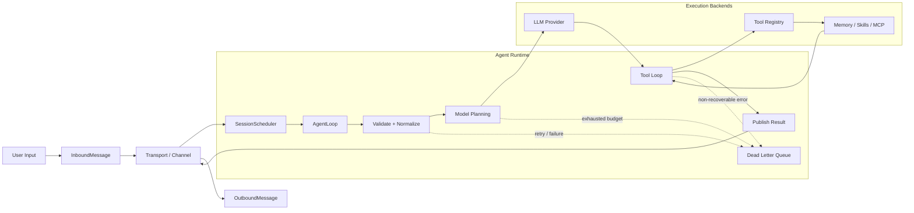

<div align="center">
  <h1>Klaw</h1>
  
  <p>Crab ❤️ Claw.</p>
</div>

## Core Design



### Key Components

- **AgentLoop** (`klaw-core`): State machine driving sessions (`Received` → `Validating` → `Scheduling` → `CallingModel` → `ToolLoop` → `Completed`)
- **SessionScheduler**: Serial execution per `session_key` with configurable queue strategies
- **Reliability**: Retry policies, idempotency stores, circuit breakers, DLQ
- **Tool System**: Trait-based abstraction (shell, fs, web, memory, sub-agent)
- **Transport**: In-memory pub/sub with multi-channel support

### Local Models

Klaw 内置本地模型子系统 (`klaw-model`)，支持从 HuggingFace 下载 GGUF 格式模型并通过 `llama-cpp-2` Rust binding 在本机推理，无需外部 API：

- **Embedding**：文本向量生成（L2 归一化），驱动 Knowledge 语义检索
- **Rerank**：基于 Yes/No logits + softmax 的二次精排，提升搜索精度
- **Orchestrator**：本地 Query Intent 分类 + Expansion 生成，替代启发式规则
- **Chat**：自回归生成，用于 Orchestrator 内部调用

测试推荐模型：

| 模型 | 用途 | repo_id |
|------|------|---------|
| EmbeddingGemma-300M | Embedding | `unsloth/embeddinggemma-300m-GGUF` |
| Qwen3-Reranker-0.6B-Q8_0 | Rerank | `ggml-org/Qwen3-Reranker-0.6B-Q8_0-GGUF` |

详见 [本地模型系统设计文档](docs/src/design/local-models.md)。

### Knowledge Search

Klaw 内置知识检索系统 (`klaw-knowledge`)，面向 Obsidian vault 等外部知识库，提供 **五路检索 + Weighted RRF 融合** 的混合搜索：

| Lane | 说明 | 依赖模型 |
|------|------|---------|
| **Semantic** | Embedding 向量检索（ANN → SQL → Rust 三级降级） | Embedding 模型 |
| **FTS** | FTS5 全文检索（bm25 或 token scoring） | 无 |
| **Graph** | Wiki-link / 隐式链接图关联跳转 | 无 |
| **Temporal** | 时间模式检索（today/recent/2025 等） | 无 |
| **Rerank** | 对融合结果二次 Yes/No softmax 精排 | Rerank 模型 |

搜索流程：Orchestrator（Intent + Expansion）→ 四路并行检索 → Pass1 WRRF 融合 → Rerank 精排 → 最终 WRRF 融合 → 截断输出。无模型时各路自动降级（Rerank 返回空 Vec 跳过，Semantic 返回空 Vec 跳过，Orchestrator 启发式回退）。

详见 [Knowledge 搜索系统设计文档](docs/src/design/knowledge-search.md)。

### GUI Preview

<div align="center">
  
</div>

### Workspace

| Crate | Purpose |
|-------|---------|
| `klaw-acp` | Agent Client Protocol integration |
| `klaw-agent` | Agent-facing orchestration utilities |
| `klaw-approval` | Approval workflows and policy gates |
| `klaw-archive` | Archive data model and storage support |
| `klaw-voice` | Voice input/output support |
| `klaw-core` | Agent runtime, scheduler, reliability |
| `klaw-util` | Shared utility helpers used across crates |
| `klaw-llm` | LLM provider adapters |
| `klaw-tool` | Tool trait & built-ins |
| `klaw-heartbeat` | Heartbeat tracking and liveness signals |
| `klaw-config` | TOML config (`~/.klaw/config.toml`) |
| `klaw-cli` | CLI binary (`klaw`) |
| `klaw-mcp` | Model Context Protocol support |
| `klaw-skill` | Skills lifecycle |
| `klaw-memory` | Long-term memory (BM25 + Vector) |
| `klaw-cron` | Scheduled task execution |
| `klaw-session` | Session lifecycle and coordination |
| `klaw-storage` | Session and persistence storage |
| `klaw-gateway` | Gateway and remote transport endpoints |
| `klaw-channel` | Channel abstractions for runtime messaging |
| `klaw-gui` | Native desktop GUI built with egui |
| `klaw-observability` | Metrics, traces, and observability tooling |
| `klaw-model` | Local GGUF model download, storage & inference |
| `klaw-knowledge` | Obsidian vault indexing, 5-lane search & RRF fusion |

## Quick Start

```bash
cargo build --workspace
cargo test --workspace

# Run
klaw                            # Launch GUI
klaw tui                        # Interactive terminal UI
klaw agent --input "prompt"     # One-shot
klaw gateway                    # WebSocket
```

Running `cargo build` directly from the root directory uses the workspace `default-members` configuration, which does not include `klaw-webui` by default. To build the browser-side WASM resources, run `make webui-wasm` first, then compile `klaw-gateway`.

## macOS Packaging

Build a native macOS app bundle and dmg from the existing GUI entrypoint:

```bash
make build-macos-app
make package-macos-dmg
```

Artifacts are written to `dist/macos/`:

- `dist/macos/Klaw.app`
- `dist/macos/Klaw-<version>-aarch64-apple-darwin.dmg`

Run skip quarantine

`xattr -rd com.apple.quarantine /Applications/Klaw.app`

See `docs/` for architecture details.

## License

MIT