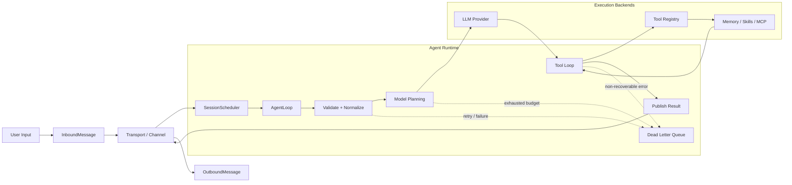
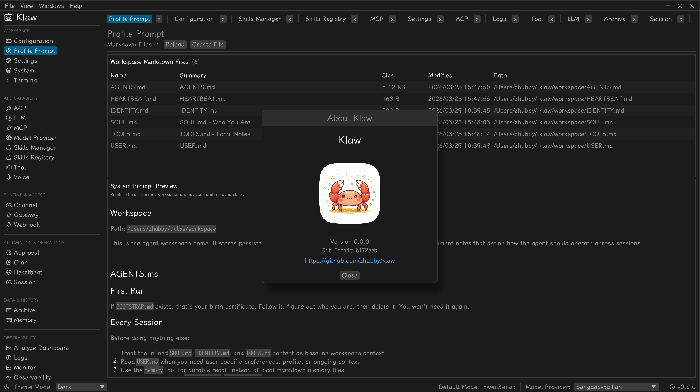

<div align="center">
  <h1>Klaw</h1>
  
  <p>Crab ❤️ Claw.</p>
</div>

## Core Design



### Key Components

- **AgentLoop** (`klaw-core`): State machine driving sessions (`Received` → `Validating` → `Scheduling` → `CallingModel` → `ToolLoop` → `Completed`)
- **SessionScheduler**: Serial execution per `session_key` with configurable queue strategies
- **Reliability**: Retry policies, idempotency stores, circuit breakers, DLQ
- **Tool System**: Trait-based abstraction (shell, fs, web, memory, sub-agent)
- **Transport**: In-memory pub/sub with multi-channel support

### GUI Preview

<div align="center">
  
</div>

### Workspace

| Crate | Purpose |
|-------|---------|
| `klaw-acp` | Agent Client Protocol integration |
| `klaw-agent` | Agent-facing orchestration utilities |
| `klaw-approval` | Approval workflows and policy gates |
| `klaw-archive` | Archive data model and storage support |
| `klaw-voice` | Voice input/output support |
| `klaw-core` | Agent runtime, scheduler, reliability |
| `klaw-util` | Shared utility helpers used across crates |
| `klaw-llm` | LLM provider adapters |
| `klaw-tool` | Tool trait & built-ins |
| `klaw-heartbeat` | Heartbeat tracking and liveness signals |
| `klaw-config` | TOML config (`~/.klaw/config.toml`) |
| `klaw-cli` | CLI binary (`klaw`) |
| `klaw-mcp` | Model Context Protocol support |
| `klaw-skill` | Skills lifecycle |
| `klaw-memory` | Long-term memory (BM25 + Vector) |
| `klaw-cron` | Scheduled task execution |
| `klaw-session` | Session lifecycle and coordination |
| `klaw-storage` | Session and persistence storage |
| `klaw-gateway` | Gateway and remote transport endpoints |
| `klaw-channel` | Channel abstractions for runtime messaging |
| `klaw-gui` | Native desktop GUI built with egui |
| `klaw-observability` | Metrics, traces, and observability tooling |

## Quick Start

```bash
cargo build --workspace
cargo test --workspace

# Run
klaw                            # Launch GUI
klaw stdio                      # Interactive
klaw agent --input "prompt"     # One-shot
klaw gateway                    # WebSocket
```

## macOS Packaging

Build a native macOS app bundle and dmg from the existing GUI entrypoint:

```bash
make build-macos-app
make package-macos-dmg
```

Artifacts are written to `dist/macos/`:

- `dist/macos/Klaw.app`
- `dist/macos/Klaw-<version>-aarch64-apple-darwin.dmg`

Run skip quarantine

`xattr -rd com.apple.quarantine /Applications/Klaw.app`

See `docs/` for architecture details.

## License

MIT
