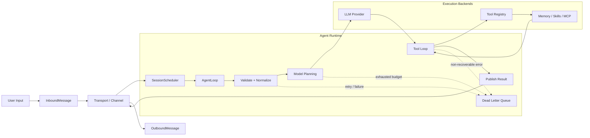

<div align="center">
  <h1>Klaw</h1>
  
  <p>Crab ❤️ Claw.</p>
</div>

## Core Design



### Key Components

**Runtime & Reliability**

- **AgentLoop** (`klaw-core`): State machine driving sessions (`Received` → `Validating` → `Scheduling` → `CallingModel` → `ToolLoop` → `Completed`)
- **SessionScheduler**: Serial execution per `session_key` with configurable queue strategies
- **Reliability**: Retry policies with exponential backoff, idempotency stores, circuit breakers, budget exhaustion, dead letter queue
- **Session Management** (`klaw-session`): Full lifecycle — create, list, archive, delete; LLM/tool audit trail, usage tracking, and compression

**Tool System (20+ built-in tools)**

- **Shell**: Execute commands with timeout, policy gates, and working directory control
- **File Read**: Read local files with line-range selection and media detection (images, PDFs)
- **Local Search**: Grep-like workspace search with pattern, path, and case filters
- **Web Fetch**: Fetch and extract web pages with character budget and content trimming
- **Web Search**: Search via Brave / Tavily APIs with result capping
- **Apply Patch**: Apply unified diff patches to local files
- **Memory** (`klaw-memory`): Long-term memory with BM25 + Vector search, governance (priority/kind/status), and automatic maintenance
- **Knowledge** (`klaw-knowledge`): Obsidian vault indexing, 5-lane hybrid search, WRRF fusion, local rerank, and context-bundle assembly
- **Sub Agent**: Spawn sub-agents for scoped, delegated tasks
- **Ask Question**: Interactive clarification loops between agent and user
- **Approval** (`klaw-approval`): Policy-gated approval workflows — create, list, resolve with accept/reject
- **Archive** (`klaw-archive`): Ingest and retrieve conversation archives with media attachment support
- **Cron Manager** (`klaw-cron`): Create, list, update, delete cron schedules; one-shot and recurring execution
- **Heartbeat Manager** (`klaw-heartbeat`): Periodic liveness probes with task-run tracking and status history
- **Skills Manager / Registry** (`klaw-skill`): Install, sync, and uninstall skills from Git registries; dynamic skill loading
- **Channel Attachment**: Attach media references (images, files, audio) to outbound channel messages
- **Terminal Multiplexer**: Manage persistent terminal sessions for long-running shell tasks
- **Geo**: Location-aware queries with geocoding support
- **Voice** (`klaw-voice`): Speech-to-text (Deepgram) and text-to-speech (ElevenLabs) streaming

**Protocol Integration**

- **MCP** (`klaw-mcp`): Model Context Protocol — discover and call external tool servers, per-server lifecycle management (bootstrap → ready → error)
- **ACP** (`klaw-acp`): Agent Client Protocol — connect to remote ACP agents, stream session events, handle permission requests and plan approvals
- **Gateway** (`klaw-gateway`): WebSocket server with embedded WebUI, Webhook receiver for external triggers, Tailscale auto-discovery for zero-config networking

**Multi-Channel Messaging**

- **Terminal / TUI** (`klaw-channel`): Interactive terminal UI with real-time agent loop
- **DingTalk**: DingTalk bot integration with interactive card rendering
- **Telegram**: Telegram bot with Markdown-formatted responses
- **Feishu**: Feishu/Lark bot support
- **WebSocket**: Bidirectional real-time channel for GUI and WebUI

**Observability & Config**

- **Audit** (`klaw-observability`): LLM call audit trail, tool invocation logs, structured event recording
- **Metrics & Telemetry**: Token usage tracking, request latency, error rates, health checks
- **Config** (`klaw-config`): Single TOML source of truth (`~/.klaw/config.toml`), validation, migration from older formats, targeted reload on partial edits

**Desktop & Web UI**

- **GUI** (`klaw-gui`): Native desktop app built with egui — 30+ panels (LLM, sessions, tools, knowledge, models, cron, MCP, ACP, observability, …)
- **WebUI** (`klaw-webui`): Browser-based WASM interface served through the gateway

### Knowledge

Klaw ships a built-in knowledge retrieval system (`klaw-knowledge`) backed by local GGUF models (`klaw-model`), enabling fully offline semantic search over Obsidian vaults — no external API required.

**Local Models** — GGUF models are downloaded from HuggingFace and run through `llama-cpp-2` Rust bindings on the host machine. Four inference capabilities are supported:

| Capability | Algorithm | Role in Knowledge Pipeline |
|-----------|-----------|---------------------------|
| **Embedding** | Tokenize → encode → L2 normalize | Drives semantic vector search |
| **Rerank** | Yes/No logits → softmax binary probability | Second-pass relevance scoring on fused results |
| **Orchestrator** | ChatML prompt → JSON parse (heuristic fallback) | Query intent classification + multi-query expansion |
| **Chat** | Greedy autoregressive generation | Internal Orchestrator channel |

Recommended test models:

| Model | Capability | repo_id |
|-------|-----------|---------|
| EmbeddingGemma-300M | Embedding | `unsloth/embeddinggemma-300m-GGUF` |
| Qwen3-Reranker-0.6B-Q8_0 | Rerank | `ggml-org/Qwen3-Reranker-0.6B-Q8_0-GGUF` |

**5-Lane Search Pipeline** — each query flows through an Orchestrator (intent + expansion), four parallel retrieval lanes, a Weighted Reciprocal Rank Fusion pass, a Rerank refinement, and a final WRRF fusion:

| Lane | Method | Model Required |
|------|--------|---------------|
| **Semantic** | Vector search with 3-tier fallback (ANN index → SQL `vector_distance_cos` → Rust cosine) | Embedding |
| **FTS** | FTS5 `MATCH + bm25()` or token-scoring fallback | — |
| **Graph** | Wiki-link + discovered link outbound traversal | — |
| **Temporal** | Date-pattern filtering (`today` / `recent` / `2025` …) | — |
| **Rerank** | Yes/No softmax re-scoring of Pass-1 fused hits | Reranker |

When a model is not configured, the corresponding lane gracefully degrades: Semantic and Rerank return empty vectors (skipped), Orchestrator falls back to heuristic intent + stopword-stripped expansions, and the remaining lanes continue with unchanged weights. See the [Local Models design doc](docs/src/design/local-models.md) and [Knowledge Search design doc](docs/src/design/knowledge-search.md) for full algorithm details.

### GUI Preview

<div align="center">
  
</div>

### Workspace

| Crate | Purpose |
|-------|---------|
| `klaw-acp` | Agent Client Protocol integration |
| `klaw-agent` | Agent-facing orchestration utilities |
| `klaw-approval` | Approval workflows and policy gates |
| `klaw-archive` | Archive data model and storage support |
| `klaw-voice` | Voice input/output support |
| `klaw-core` | Agent runtime, scheduler, reliability |
| `klaw-util` | Shared utility helpers used across crates |
| `klaw-llm` | LLM provider adapters |
| `klaw-tool` | Tool trait & built-ins |
| `klaw-heartbeat` | Heartbeat tracking and liveness signals |
| `klaw-config` | TOML config (`~/.klaw/config.toml`) |
| `klaw-cli` | CLI binary (`klaw`) |
| `klaw-mcp` | Model Context Protocol support |
| `klaw-skill` | Skills lifecycle |
| `klaw-memory` | Long-term memory (BM25 + Vector) |
| `klaw-cron` | Scheduled task execution |
| `klaw-session` | Session lifecycle and coordination |
| `klaw-storage` | Session and persistence storage |
| `klaw-gateway` | Gateway and remote transport endpoints |
| `klaw-channel` | Channel abstractions for runtime messaging |
| `klaw-gui` | Native desktop GUI built with egui |
| `klaw-observability` | Metrics, traces, and observability tooling |
| `klaw-model` | Local GGUF model download, storage & inference |
| `klaw-knowledge` | Obsidian vault indexing, 5-lane search & RRF fusion |

## Quick Start

```bash
cargo build --workspace
cargo test --workspace

# Run
klaw                            # Launch GUI
klaw tui                        # Interactive terminal UI
klaw agent --input "prompt"     # One-shot
klaw gateway                    # WebSocket
```

Running `cargo build` directly from the root directory uses the workspace `default-members` configuration, which does not include `klaw-webui` by default. To build the browser-side WASM resources, run `make webui-wasm` first, then compile `klaw-gateway`.

## macOS Packaging

Build a native macOS app bundle and dmg from the existing GUI entrypoint:

```bash
make build-macos-app
make package-macos-dmg
```

Artifacts are written to `dist/macos/`:

- `dist/macos/Klaw.app`
- `dist/macos/Klaw-<version>-aarch64-apple-darwin.dmg`

Run skip quarantine

`xattr -rd com.apple.quarantine /Applications/Klaw.app`

See `docs/` for architecture details.

## License

MIT