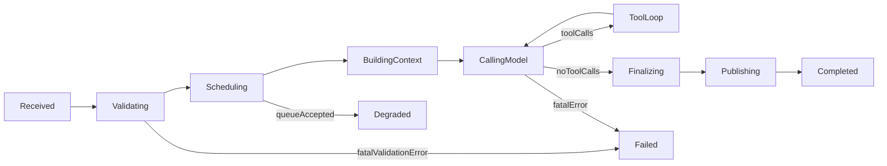

# Agent Runtime State Machine

## 1. 状态定义

- `Received`: 已从 `agent.inbound` 收到消息
- `Validating`: 入站与策略校验（schema、auth、safety）
- `Scheduling`: 会话调度（`session_key` 串行）
- `BuildingContext`: 上下文组装（system/history/memory）
- `CallingModel`: 首次模型调用
- `ToolLoop`: 工具回路阶段（可能多轮）
- `Finalizing`: 汇总最终答案与会话落盘
- `Publishing`: 发布 `agent.outbound` 或 `agent.events`
- `Completed`: 正常完成
- `Degraded`: 可恢复降级（排队、重试、fallback）
- `Failed`: 不可恢复失败

## 2. 转移规则

## 3. 会话调度策略

- 串行主约束：同一 `session_key` 只允许一个活跃任务
- 忙时策略：
  - `Collect`: 入队等待，原顺序处理
  - `FollowUp`: 聚合为下一条 follow-up 任务
  - `Drop`: 达到上限后拒绝并返回 `SessionBusy`
- 队列上限：`max_queue_depth`
- 锁超时：`lock_ttl`，防止 worker 异常导致永久占锁

## 4. 超时与降级

- `agent_timeout_secs`：总运行超时，触发 `Degraded` 或 `Failed`
- `tool_timeout_secs`：单工具超时，优先降级继续，再判断是否失败
- 降级路径：`ToolLoop -> CallingModel(no tool)` 或写入 `agent.events` 供上层补偿
