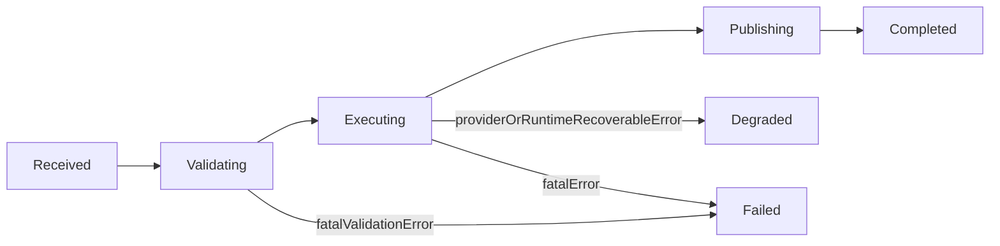

# Agent Runtime State Machine

## 1. 状态定义

- `Received`: 已从 `agent.inbound` 收到消息
- `Validating`: 入站基础校验与 provider/model 解析
- `Executing`: 单次 turn 执行阶段；由 `klaw-agent::run_agent_execution` 负责上下文组装、模型调用、工具回路与短路信号
- `Publishing`: 发布 `agent.outbound` 或流式 snapshot
- `Completed`: 正常完成
- `Degraded`: 可恢复降级（provider/reliability 等外层故障）
- `Failed`: 不可恢复失败

## 2. 转移规则

## 3. 会话调度策略

- `SessionScheduler` 仍是 `klaw-core` 提供的抽象，但当前 `AgentLoop` 主路径没有直接驱动队列状态迁移
- `SessionSchedulingPolicy` 目前主要保留运行时配置与幂等 TTL 相关信息
- 若后续需要 `Collect` / `FollowUp` / `Drop` 的真实队列语义，应在持有工作队列的 runtime / worker 层接入 `SessionScheduler`

## 4. 超时与降级

- `agent_timeout_secs` / `tool_timeout_secs` 仍属于运行时限制配置，但当前实现的主要强约束是 tool iteration / tool call / token budget
- 执行内核会返回显式 disposition：
  - `FinalMessage`
  - `ApprovalRequired`
  - `Stopped`
- 外层 `AgentLoop` 负责把 disposition 翻译成 outbound metadata，例如 `approval.*`、`turn.stopped`、`turn.stop_signal`、`turn.disposition`
