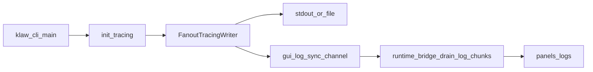

# GUI 实时日志流

## 概述

`klaw gui` 现在提供独立的 `Logs` 面板，用于实时查看当前进程的日志输出。  
日志来源覆盖同一进程内的 CLI 初始化阶段、GUI 主线程以及 runtime worker 中的 `tracing` 输出。

该能力主要用于：

- 启动与运行期问题排查
- 面板操作回归时的可视化观测
- 无需切换终端即可快速定位错误与告警

## 数据流设计

## 实现位置

- `klaw-cli/src/main.rs`
  - `create_gui_log_sender_for_command(...)`
  - `FanoutTracingWriter` / `GuiTracingWriter`
  - `init_tracing(...)` 中 `Gui` 分支注入 writer 扇出
- `klaw-cli/src/commands/gui.rs`
  - GUI 生命周期结束时清理日志接收器
- `klaw-gui/src/runtime_bridge.rs`
  - `install_log_receiver(...)`
  - `clear_log_receiver(...)`
  - `drain_log_chunks(...)`
- `klaw-gui/src/panels/logs.rs`
  - `LogsPanel` 实时拉取、过滤、搜索与渲染

## 面板功能

`Logs` 面板提供以下能力：

- **实时流显示**：按固定间隔从 bridge 非阻塞拉取日志块并渲染
- **级别过滤**：`trace/debug/info/warn/error/unknown`
- **关键词搜索**：不区分大小写
- **暂停流消费**：暂停后不继续吸收新日志数据
- **自动滚动**：可开启/关闭粘底显示
- **清空缓冲**
- **导出文件**：支持自定义导出路径
- **容量上限**：按“行数”控制保留窗口，超限 FIFO 淘汰并统计 dropped

## 性能与稳定性策略

- GUI sink 使用**非阻塞发送**，即使通道满/断开也不会阻塞主日志路径
- UI 每帧仅按批次拉取（`max_batch`）以避免日志洪峰导致卡顿
- 采用有界内存缓冲，防止长时间运行造成无限增长

## 使用说明

1. 启动 GUI：`klaw gui`
2. 在左侧导航进入 `Logs`
3. 根据需要切换日志级别、输入关键词、暂停/恢复流
4. 需要留档时点击 `Export` 导出

## 测试覆盖

- `klaw-cli`
  - GUI sink 断开时写入不报错、不影响主 sink
  - fanout writer 仍可正常写主 sink
- `klaw-gui`
  - 缓冲区上限淘汰逻辑
  - 过滤与搜索组合逻辑
  - 日志等级解析逻辑

## 已知限制

- 当前解析等级基于行文本匹配（兼容常见 `tracing` 文本格式），不是结构化字段解析
- 暂停流消费期间，新日志不会进入面板缓冲（恢复后仅看到恢复后的新流）
