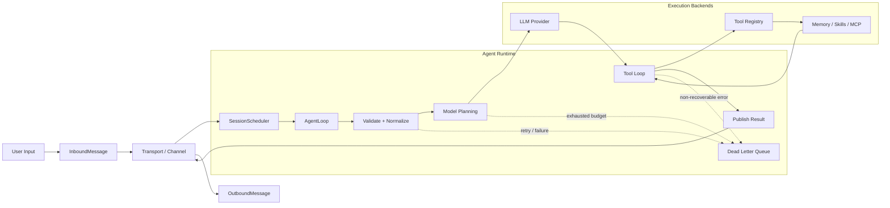

# Klaw 项目简介

Klaw (Crab ❤️ Claw) 是一个用 Rust 构建的**生产级 AI Agent 运行时框架**，提供基于消息驱动的架构设计和全面的可靠性控制，支持从单机 CLI 到分布式多租户部署。

## 核心特性

- **会话级并发控制**：基于 `session_key` 的串行执行保证，同会话消息严格顺序处理，多会话并行独立执行
- **端到端可靠性保障**：指数退避重试、幂等去重存储、熔断器、预算控制、死信队列，容错与可观测性内置
- **可扩展工具系统**：Trait 抽象的工具接口，内置 Shell、文件系统、Web 搜索、长期记忆、子 Agent 调用等能力
- **多协议支持**：原生支持 [Model Context Protocol (MCP)](https://modelcontextprotocol.io/) 和 Agent Client Protocol (ACP)
- **Skills 生态**：兼容 Skill 格式，支持从 Git 仓库动态同步技能定义
- **多模态能力**：支持语音输入转文字（ASR）和语音合成（TTS），可接入多种语音提供商
- **长期记忆**：内置 BM25 + Vector 双层检索记忆，支持知识持久化
- **多 LLM 后端**：统一抽象层，支持 OpenAI 兼容接口、Anthropic 等主流提供商
- **持久化存储**：支持 Turso/libSQL 和 SQLx 后端，统一 Trait 抽象
- **部署灵活**：支持 CLI 交互、终端 TUI、原生桌面 GUI、WebSocket 网关等多种部署模式
- **可观测性**：内置 OpenTelemetry 支持，提供指标、链路追踪能力

## 架构概览



Klaw 采用消息驱动的架构风格：

1. **消息信封**：所有跨模块消息统一使用 `Envelope<T>` 封装，包含追踪、重试、路由元数据
2. **主题路由**：通过逻辑主题 (`agent.inbound`/`agent.outbound`/`agent.events`/`agent.dlq`) 解耦生产者和消费者
3. **状态机驱动**：`AgentLoop` 作为状态机驱动会话从接收 → 校验 → 调度 → 模型调用 → 工具循环 → 完成全流程
4. **至少一次交付**：幂等键保证重试不会导致重复处理

详细设计文档：
- [消息协议](./agent-core/message-protocol.md)
- [运行时状态机](./agent-core/runtime-state-machine.md)
- [可靠性控制](./agent-core/reliability-controls.md)

## 工作空间结构

| Crate | 职责 |
|-------|------|
| `klaw-acp` | Agent Client Protocol 集成 |
| `klaw-agent` | Agent 编排高层工具集 |
| `klaw-approval` | 审批工作流与策略闸门 |
| `klaw-archive` | 媒体归档数据模型与存储 |
| `klaw-voice` | 语音 ASR/TTS 支持 |
| `klaw-core` | Agent 核心运行时、调度器、可靠性控制 |
| `klaw-util` | 跨 crate 共享工具库 |
| `klaw-llm` | LLM 提供商抽象与适配（OpenAI 兼容、Anthropic） |
| `klaw-tool` | 工具 Trait 定义与内置工具实现 |
| `klaw-heartbeat` | 会话心跳追踪与存活探测 |
| `klaw-config` | TOML 配置加载（`~/.klaw/config.toml`） |
| `klaw-cli` | CLI 二进制入口（`klaw`） |
| `klaw-mcp` | Model Context Protocol 支持 |
| `klaw-skill` | Skills 生命周期管理 |
| `klaw-memory` | 长期记忆服务（BM25 + Vector 检索） |
| `klaw-cron` | 定时任务调度执行 |
| `klaw-session` | 会话生命周期与协调 |
| `klaw-storage` | 会话与任务持久化存储抽象 |
| `klaw-gateway` | WebSocket 网关与远程传输端点 |
| `klaw-channel` | 多渠道接入抽象（钉钉、Telegram 等） |
| `klaw-tui` | 终端交互式 UI |
| `klaw-gui` | 原生桌面 GUI（基于 egui） |
| `klaw-ui-kit` | 共享 UI 组件库 |
| `klaw-observability` | 指标、链路追踪可观测性工具 |
| `klaw-runtime` | 高层运行时组装与启动 |
| `klaw-webui` | 浏览器端 Web UI（WASM，可选构建） |

## 快速链接

- [快速开始](./quickstart.md)
- [Agent Core](./agent-core/README.md)
- [工具文档](./tools/README.md)
- [存储文档](./storage/README.md)
- [设计计划](./plans/README.md)

---

# 关于本文档

本文档使用 [mdbook](https://rust-lang.github.io/mdBook/) 构建，是 Klaw 项目的官方文档。

## 安装 mdbook

```bash
# 使用 cargo 安装 mdbook (推荐使用 v0.4.40 版本)
# 注意：v0.5.x 版本存在字体渲染问题
cargo install mdbook --version 0.4.40

# 安装 Mermaid 预处理器（图表支持）
cargo install mdbook-mermaid --version 0.14.0

# 可选：其他预处理器
cargo install mdbook-katex      # LaTeX 数学公式支持
```

**版本兼容性说明：**
- `mdbook` v0.5.x 存在字体渲染问题（Missing font github）
- `mdbook-admonish` v1.20.0 存在 TOML 解析 bug，暂时无法使用
- 推荐组合：`mdbook@0.4.40` + `mdbook-mermaid@0.14.0`

## 构建文档

```bash
# 进入 docs 目录
cd docs

# 构建静态站点（输出到 docs/book/）
mdbook build

# 清理并重新构建
mdbook clean && mdbook build
```

## 开发模式（实时预览）

```bash
# 启动本地服务器，默认访问 http://localhost:3000
mdbook serve

# 指定端口
mdbook serve -p 8000

# 监听所有网络接口
mdbook serve -n 0.0.0.0
```

## 目录结构

```
docs/
├── book.toml          # mdbook 配置文件
├── book/              # 构建输出目录（自动生成）
└── src/
    ├── SUMMARY.md     # 文档目录和导航结构
    ├── introduction.md # 项目简介（本文件）
    ├── quickstart.md  # 快速开始指南
    ├── agent-core/    # Agent 核心文档
    ├── tools/         # 工具文档
    ├── storage/       # 存储文档
    ├── gateway/       # 网关文档
    └── plans/         # 设计计划
```

## 编写规范

- 所有文档使用 Markdown 格式
- 代码块标注语言类型以启用语法高亮
- 使用相对路径链接其他文档
- 遵循 [Rust API 文档风格](https://doc.rust-lang.org/rust-by-example/)
