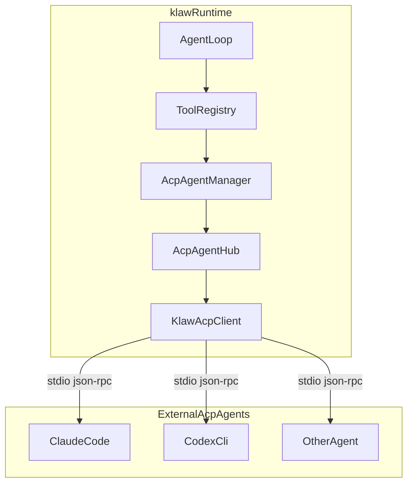

# ACP Client 集成设计

## 背景

Issue [#109](https://github.com/zhubby/klaw/issues/109) 最初讨论的是把 klaw 做成 ACP server，让外部编辑器把 klaw 当作 Agent 使用。调研后，当前更符合 klaw 定位的方向是反过来: klaw 自己作为 ACP client，去调用外部已实现 ACP 的编码 Agent，例如 Claude Code、Codex CLI、Gemini CLI 或 Goose。

这条路线让 klaw 获得类似 Zed 的能力:

- 复用 ACP 生态中已有的 Agent 实现
- 避免为每个编码 Agent 单独做私有协议适配
- 让 klaw 成为统一编排层，而不是只提供自有 Agent

## 设计结论

首版 ACP 集成采用以下方案:

- 新增独立 crate: `klaw-acp`
- klaw 作为 ACP client，使用 stdio transport 启动外部 Agent 子进程
- 每个 ACP Agent 以 `Tool` 的形式暴露给 klaw 自身的 AgentLoop
- 生命周期管理模式复用 `klaw-mcp` 的 `Manager + Hub + ProxyTool` 架构
- Phase 1 先打通最小路径: 配置、启动、会话、prompt、流式文本聚合
- Phase 2 再补权限审批、终端代理、MCP 透传、GUI 管理等增强能力

## 模块放置

### `klaw-acp`

负责 ACP 客户端侧的领域逻辑，包括:

- ACP Agent 配置快照
- 外部 Agent 子进程的生命周期管理
- `ClientSideConnection` 封装
- `acp::Client` 实现
- ACP 会话与 klaw tool 调用之间的桥接

### `klaw-config`

新增 `AcpConfig`，用于声明可调用的 ACP Agent 列表及其启动参数。

### `klaw-cli runtime`

在 `build_runtime_bundle()` 中启动 ACP manager，并把每个 ACP Agent 作为 tool 注册进共享 `ToolRegistry`。

### `klaw-tool`

不新增 ACP 专用 trait，继续复用现有 `Tool` 抽象，只增加 ACP proxy tool 的实现。

## 架构概览



## 核心抽象

### `AcpAgentManager`

职责:

- 维护 `agent_id -> connection handle`
- 按配置启动 ACP Agent 子进程
- 对外提供 `prompt(agent_id, cwd, prompt)` 这样的高层接口
- 负责 shutdown 和失败回收

形态参考 `klaw-mcp/src/manager.rs`:

```rust
pub struct AcpAgentManager {
    tools: ToolRegistry,
    hub: AcpAgentHub,
    agents: BTreeMap<AcpAgentKey, AcpAgentHandle>,
    config: AcpConfigSnapshot,
}
```

### `AcpAgentHub`

职责:

- 以 `agent_id` 为 key 保存连接句柄
- 让 `AcpProxyTool` 不直接持有子进程细节
- 为后续多会话复用提供统一路由入口

### `KlawAcpClient`

实现 `agent_client_protocol::Client`，处理外部 Agent 反向请求:

- `request_permission`
- `session_notification`
- `read_text_file`
- `write_text_file`
- `create_terminal`
- `terminal_output`
- `wait_for_terminal_exit`
- `kill_terminal`
- `release_terminal`

v1 中:

- `session_notification` 必做
- `request_permission` 先走自动批准或最小策略
- 文件读写先限定在工作目录内
- 终端相关接口先实现最小可用语义

### `AcpProxyTool`

每个 ACP Agent 最终都会注册为一个 tool，典型名称为:

```text
acp_agent_claude_code
acp_agent_codex
```

tool 执行流程:

1. 获取或启动目标 ACP Agent
2. `initialize`
3. `new_session`
4. `prompt`
5. 聚合 `session/update` 中的文本、thought、tool call 状态
6. 输出 `ToolOutput`

## 配置设计

建议在 `klaw-config` 顶层新增:

```toml
[acp]
startup_timeout_seconds = 30

[[acp.agents]]
id = "claude_code"
enabled = true
command = "claude"
args = []
cwd = "."
description = "Claude Code agent for complex coding tasks"

[[acp.agents]]
id = "codex"
enabled = true
command = "codex"
args = ["--agent"]
cwd = "."
description = "OpenAI Codex CLI agent"
```

对应配置模型:

```rust
pub struct AcpConfig {
    pub startup_timeout_seconds: u64,
    pub agents: Vec<AcpAgentConfig>,
}

pub struct AcpAgentConfig {
    pub id: String,
    pub enabled: bool,
    pub command: String,
    pub args: Vec<String>,
    pub env: BTreeMap<String, String>,
    pub cwd: Option<String>,
    pub description: String,
}
```

## 运行链路

完整链路如下:

1. `klaw-cli` 加载 `AppConfig`
2. runtime bootstrap 创建 `ToolRegistry`
3. ACP manager 根据 `config.acp` 建立配置快照
4. enabled 的 ACP Agent 被注册为 proxy tools
5. klaw 自身模型在工具规划阶段选择某个 ACP Agent tool
6. proxy tool 触发 `initialize -> new_session -> prompt`
7. 外部 Agent 通过 `session/update` 回传流式事件
8. ACP client 聚合输出并转换为 `ToolOutput`
9. klaw 主 agent 继续把外部 Agent 返回结果纳入后续推理

## 与 MCP 架构的关系

ACP 集成应尽量复用 `klaw-mcp` 的成功模式，但两者边界不同:

- MCP: klaw 连接工具服务器，暴露远端 tool
- ACP: klaw 连接智能 Agent，暴露远端 agent 能力

共有点:

- 都是外部进程或远端能力接入
- 都需要 manager 管理生命周期
- 都要注册 proxy tool 到 `ToolRegistry`

差异点:

- ACP 有 session 生命周期
- ACP 是双向 RPC，Agent 会反向请求文件、终端、权限
- ACP 输出是流式的 session update，不只是一次性 tool result

## Phase 1 实施范围

首阶段目标:

1. `docs/src/plans/acp-client-integration.md` 文档落地并接入 mdBook
2. 新增 `klaw-acp` crate
3. `klaw-config` 新增 ACP 配置结构
4. `klaw-cli` runtime 启动时加载 ACP manager
5. 把 ACP Agent 注册为 tool
6. 打通 stdio ACP 连接骨架
7. 支持单轮 prompt 和文本结果聚合

首阶段暂不完成:

- GUI 配置面板
- 复杂权限审批 UI
- MCP servers 透传到外部 ACP Agent
- session/load 恢复
- 多终端复用与高级流式可视化

## 测试方案

需要覆盖以下场景:

1. `AcpConfig` 默认值与反序列化正确
2. disabled agent 不会被注册
3. runtime 启动时 ACP tools 正确进入 `ToolRegistry`
4. 配置变化时 manager 能按计划 start or stop agent
5. `session_notification` 能正确聚合 `AgentMessageChunk`
6. prompt 执行失败时返回结构化 `ToolError`
7. 非法 cwd 或越界文件访问会被拒绝
8. 终端相关最小实现不会泄漏子进程资源

## 后续演进

后续可以继续补齐:

- ACP agent 健康检查与自动重启
- `klaw-approval` 集成，支持真正的人机审批
- GUI 中的 ACP agent 配置与运行状态面板
- 会话持久化与恢复
- MCP server 透传，允许外部 ACP Agent 共享 klaw 已配置的 MCP 能力
