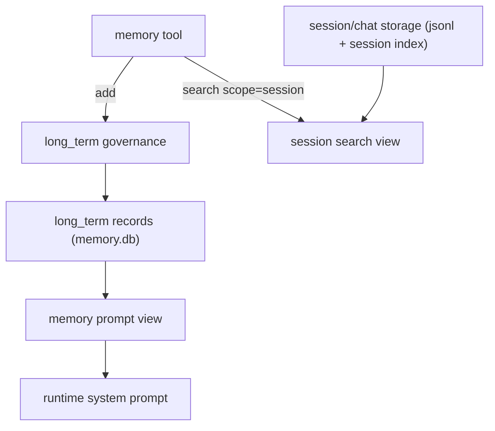

# 两层 Memory 设计

本文档记录当前 memory 改造后的架构决策，包括：

- `persistent_memory`（长期记忆）的职责与治理
- `session_memory`（会话记忆）的职责与检索方案
- `memory` 工具的收敛语义

## 设计目标

- 提高 memory 写入与检索效率
- 避免 session 记忆重复持久化
- 让长期记忆真正变成“稳定事实”，而不是会话日志堆积
- 让模型侧工具语义尽可能简单

## 最终架构

## 一、长期记忆方案

### 1. 职责

长期记忆用于保存跨轮次、跨 session 仍然成立的稳定信息，例如：

- 身份信息
- 用户偏好
- 项目规则
- 长期工作约束
- 可复用事实

它不应该保存：

- 临时上下文
- 单轮任务步骤
- 纯粹会话流水
- cron / heartbeat / webhook 触发带来的瞬时信息

### 2. 存储层

长期记忆仍然保存在 `memory.db` 的 `memories` 表中，`scope = "long_term"`。

source of truth 仍然是原始记忆记录，不是 prompt 文本。

### 3. 写入治理

长期记忆新增正式治理层，规则位于 `klaw-memory/src/governance.rs`。

治理步骤：

1. 规范化 `content`
2. 规范化 `kind`
3. 校验 `status`
4. 规范化 `topic`
5. 规范化 `supersedes`
6. 精确重复检测
7. 冲突替换

#### `kind`

允许值：

- `identity`
- `preference`
- `project_rule`
- `workflow`
- `fact`
- `constraint`

默认值：

- 若未指定，则为 `fact`

#### `status`

允许系统内部使用：

- `active`
- `superseded`
- `archived`
- `rejected`

外部新写入时只接受：

- `active`

也就是说，`superseded / archived / rejected` 是系统托管状态，不能由模型直接创建。

#### `topic`

`topic` 是长期记忆冲突替换的关键字段。

它表示“这条记忆在解决哪一个长期主题”。

例如：

- `reply_language`
- `verbosity`
- `coding_style`
- `project_default_branch`

#### `supersedes`

若一条新记忆显式替代旧记忆，可以通过 `supersedes` 指定一个或多个旧记录 ID。

系统也会在检测到冲突时自动补齐。

### 4. 冲突替换逻辑

当前冲突替换策略采用精确且可解释的规则：

- 同一 `kind`
- 同一 `topic`
- 旧记录当前为 `active`

满足以上条件时：

- 旧记录自动改为 `status = "superseded"`
- 旧记录补 `superseded_by = <new_id>`
- 新记录补 `supersedes = [old_id, ...]`

这样可以避免两条互相冲突的长期偏好同时进入 prompt。

### 5. 重复检测

若新写入内容与现有 active 记录在规范化后完全一致，则：

- 复用原记录 ID
- 更新 metadata / pinned
- 不额外制造一条重复长期记忆

### 6. Prompt 注入治理

长期记忆不会通过 `memory search(long_term)` 再由模型主动取回，而是由 runtime 在每轮处理前整理成 `Memory` 章节注入 `system prompt`。

渲染规则：

- 仅取 `status=active`
- `pinned` 优先
- 按 `kind` 优先级排序
- 同内容去重
- 单条长度裁剪
- 整体字符预算裁剪

这一步的目标是：

- 控制 prompt 膨胀
- 保证长期记忆可读
- 保持 system prompt 的稳定性

## 二、Session 记忆方案

### 1. 职责

session 记忆只负责“回看近期会话上下文”，不负责长期事实治理。

典型场景：

- 查询最近 1 天内谈到过什么
- 查询最近 3 天内某个问题是否讨论过
- 在多 active session 之间回看同一个 base session 的近期上下文

### 2. 为什么不单独持久化

当前实现复用现有 session/chat 存储，而不是新增第二套 session memory 表。

原因：

- chat JSONL 已经是现成的 source of truth
- 若再做一套 session memory，会形成双写
- 双写会重新引入一致性和性能问题

因此 session 记忆被定义为：

**基于现有 session/chat 存储的检索视图**

### 3. source of truth

session 记忆来自：

- `SessionStorage` 的 session 索引
- 每个 session 对应的 chat JSONL

### 4. 检索范围

session 检索不查 `long_term`，也不与长期记忆合并召回。

`scope=session` 的含义是：

- 只查 session
- 不查 `long_term`
- 不做混排

检索键解析顺序：

1. 优先 `channel.base_session_key`
2. 再尝试通过 active session 反查 base session
3. 最后回退到当前 `ctx.session_key`

若 base session 绑定了 active session，则会合并 base 与 active 的聊天记录作为候选。

### 5. 检索过滤

session 检索支持：

- `within_days`
- `limit`

并且只读取：

- `user`
- `assistant`

不读取：

- heartbeat 注入消息
- cron 执行消息
- webhook 执行中间态

### 6. 检索结果

当前返回粒度是命中的单条聊天记录，包含：

- `session_key`
- `ts_ms`
- `role`
- `content`
- `score`

后续如果需要更强上下文，可以再扩展为“命中记录 + 邻近上下文片段”。

## 三、Memory Tool 收敛语义

最终模型侧工具语义被收敛为：

- `add`
  - 只写长期记忆
- `search`
  - 只查 session 记忆

不再提供：

- `search + scope=long_term`
- `add + scope=session`
- `scope=both`

这个收敛的好处是：

- 模型决策更简单
- prompt 语义更清晰
- runtime 更容易做长期治理

## 四、当前实现状态

已完成：

- `memory add` 走长期记忆治理
- `kind/status/topic/supersedes` 正式进入规则层
- 同一 `kind + topic` 的 active 长期记忆自动 supersede
- 长期记忆每轮受控注入 `system prompt`
- session 检索复用现有 session/chat 存储
- `search scope=session` 仅查 session

尚可继续增强：

- `topic` 自动推断
- 相似而非完全相同的重复检测
- 更强的冲突识别
- session 命中片段返回而非单条 message
- GUI 中展示 active / superseded / archived 视图
