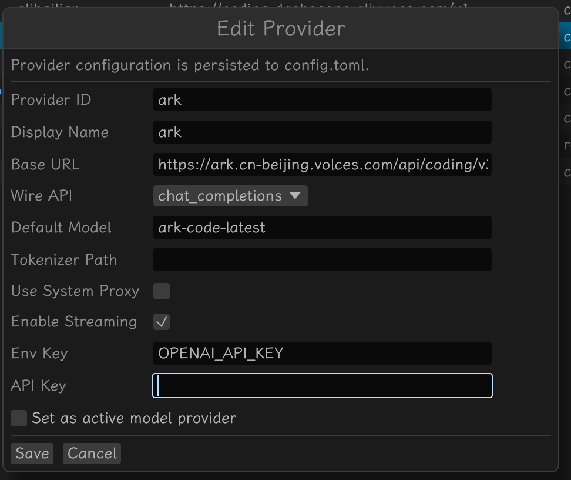
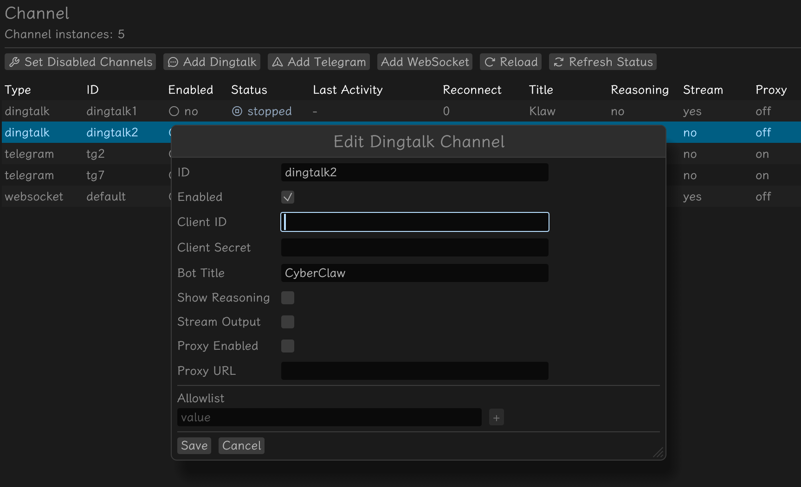

# Quick Start

本指南将带你从零开始，快速完成 Klaw 的两项核心配置——**模型 Provider** 和 **DingTalk 渠道**，让机器人跑起来。每一步中我们会解释表单字段的含义，帮助你理解为什么这样填。

---

## 前置准备

开始配置前，请确认你已具备以下条件：

1. **Klaw 已安装**——通过 `klaw tui` 或 `klaw gui` 启动
2. **API 密钥**——至少有一个模型服务的密钥（如 OpenAI、DeepSeek 等）
3. **钉钉应用**——已在 [钉钉开发者后台](https://open-dev.dingtalk.com/) 创建企业内部应用，获取了 AppKey 和 AppSecret

> 如果你暂时没有钉钉应用，可以先完成模型 Provider 配置，后续接入钉钉时再做完整验证。

---

## 第一步：创建模型 Provider

模型 Provider 是 Klaw 与大模型服务通信的入口。没有它，所有渠道都无法响应消息。

在 Klaw GUI 的「Provider」面板中点击 **添加 Provider**，弹出如下表单：



### 必填项

**Provider ID**——Provider 的唯一标识，对应 `config.toml` 中 `model_providers` 的键名。填小写英文即可，如 `openai`、`deepseek`、`local`。此 ID 创建后不宜随意修改（已有会话可能引用它），GUI 支持改名并自动更新引用。

**Base URL**——模型 API 的基础地址。Klaw 根据 Wire API 类型在此地址后拼接端点路径。常见填法：

| 模型服务 | Base URL |
|----------|----------|
| OpenAI | `https://api.openai.com/v1` |
| DeepSeek | `https://api.deepseek.com/v1` |
| 通义千问 | `https://dashscope.aliyuncs.com/compatible-mode/v1` |
| 本地 Ollama | `http://localhost:11434/v1` |

**Wire API**——下拉选择 API 协议类型，决定请求格式和端点路径：
- `chat_completions`：OpenAI Chat Completions 格式，绝大多数兼容服务都用这个
- `responses`：OpenAI Responses API 格式，仅用于 OpenAI 官方新版 API

> 如果你使用 DeepSeek、通义千问、Ollama 等兼容服务，一律选 `chat_completions`。选错会导致调用失败（404 或格式错误）。

**Default Model**——该 Provider 的默认模型名称。会话中未通过 `/model` 指定模型时，Klaw 使用此值。常见填法：OpenAI → `gpt-4o-mini`，DeepSeek → `deepseek-chat`，Ollama → `qwen3:8b`。

**密钥配置（API Key 或 Env Key 二选一）**：
- **API Key**（推荐）：直接填写密钥字符串，保存在 `~/.klaw/config.toml` 中。macOS 打包应用不会继承 shell 环境变量，Env Key 可能无法生效，因此推荐直接填入 API Key。配置完成后建议设置文件权限：`chmod 600 ~/.klaw/config.toml`
- **Env Key**：填写环境变量名，如 `OPENAI_API_KEY`，Klaw 启动时从环境变量读取密钥。仅适用于通过终端命令（`klaw tui` 等）启动的场景，macOS 打包应用启动时通常无法获取用户 shell 环境变量，存在密钥读取失败的风险

> 密钥解析优先级：`api_key` > `env_key`。两者都填时优先使用 `api_key`。本地 Ollama 无需密钥，两者均可留空。

### 建议勾选的选项

**Set as active model provider**——勾选后保存时会将该 Provider 设为当前活跃 Provider，所有会话默认使用它。首次配置务必勾选。

**Enable Streaming**——开启后模型 API 使用流式响应（`stream: true`），逐 token 接收并推送。大多数场景推荐开启，体验更流畅。

### 可选项

**Display Name**——GUI 面板中显示的友好名称，如 `"OpenAI"`、`"DeepSeek"`、`"本地 Qwen"`。可随时修改，不影响功能。

**Tokenizer Path**——自定义分词器文件路径（如 `/path/to/tokenizer.json`），用于精确计算 token 用量。日常使用可留空，Klaw 内置估算足够。

**Use System Proxy**——勾选后模型 API 请求走 `HTTP_PROXY` / `HTTPS_PROXY` 环境变量指定的代理。企业内网需要代理访问外网 API 时启用。

### 保存

填写完成后点击 **Save**。如果勾选了「Set as active model provider」，该 Provider 立即生效。

---

## 第二步：创建 DingTalk 渠道

模型 Provider 就绪后，接下来接入钉钉，让用户可以在钉钉中与机器人对话。

在 Klaw GUI 的「渠道」面板中点击 **添加 DingTalk 渠道**，弹出如下表单：



### 必填项

**ID**——渠道账户标识符，参与会话键生成（`dingtalk:{id}:{chat_id}`）。多个钉钉机器人需用不同 ID。填简短有辨识度的名称，如 `default`、`company-a`。

**Client ID**——钉钉应用的 **AppKey**。在钉钉开发者后台的「凭证与基础信息」页面获取。用于调用 `/v1.0/gateway/connections/open` 获取 WebSocket 接入点。

**Client Secret**——钉钉应用的 **AppSecret**，与 Client ID 配对。同样从开发者后台获取。

> ⚠️ AppSecret 是敏感信息，切勿泄露。配置完成后建议检查 `~/.klaw/config.toml` 的文件权限。

### 基本选项

**Enabled**——勾选后 Klaw 启动时自动建立钉钉 WebSocket 长连接并监听消息。调试时可先禁用，确认无误后再启用。

**Bot Title**——机器人显示名称，默认 `"Klaw"`。群聊中用户通过 `@{bot_title}` 触发机器人，Klaw 会自动从正文剥离 @引用。建议与钉钉开发者后台设置的机器人名称一致。

### 流式输出（可选进阶）

**Stream Output**——勾选后使用钉钉互动卡片实现流式输出，用户能看到模型实时生成过程。不开则等完整响应一次性弹出。

开启后需填写两个额外字段：
- **Stream Template ID**：钉钉互动卡片的模板 ID。在钉钉开发者后台「卡片搭建器」中创建模板（含文本数据字段），发布后复制模板 ID。
- **Stream Content Key**：卡片模板中承载流式文本的数据字段键名，默认 `"content"`。若模板字段名不同则需修改。

> 初次配置建议先不开启流式输出，确认基本功能正常后再配置互动卡片。

### 安全控制

**Allowlist**——发送者白名单，限制哪些钉钉用户可以触发机器人：
- 留空或填 `*` = 允许所有人
- 填具体 StaffId = 仅允许指定用户，如 `["USER123", "USER456"]`

> 测试阶段建议留空（允许所有人），上线后按需限制。

### 代理（可选）

**Proxy Enabled** + **Proxy URL**——企业内网钉钉 API 需走代理时启用。Proxy URL 格式为 `http://host:port`，如 `http://127.0.0.1:8888`。此代理仅影响钉钉渠道请求，不影响模型 Provider。

### 其他选项

**Show Reasoning**——勾选后在钉钉回复中展示模型推理过程，适用于代码审查、数据分析等需要透明决策的场景。日常使用建议关闭，消息更简洁。

### 保存

填写完成后点击 **Save**，然后确保 **Enabled** 已勾选。Klaw 会自动建立钉钉 WebSocket 连接。

---

## 第三步：验证运行

Provider 和 DingTalk 渠道都配置完成后，直接在钉钉中进行端到端验证：

### 在钉钉中发送消息

在钉钉中找到已配置的机器人，发送一条消息（如「你好」）。如果机器人正常回复，说明模型 Provider 和 DingTalk 渠道均配置成功。

如果无响应或报错，按以下顺序排查：

**渠道层排查**：
- Client ID / Client Secret 是否与钉钉开发者后台一致
- 钉钉应用是否已发布且机器人功能已启用
- 企业内网环境下是否需要配置 Proxy
- Klaw 日志中是否有连接错误（GUI「Logs」面板可查看）

**模型层排查**：
- API Key 是否有效（直接填写的密钥是否正确）
- Base URL 是否可达
- Wire API 是否匹配服务类型

### 切换 Provider

如需在多个 Provider 间切换：
- GUI：在 Provider 面板点击「设为活跃」
- 会话中：`/model_provider <id>`
- 配置文件：修改 `config.toml` 中顶层 `model_provider` 字段

---

## 配置示例

以下是最简配置，可直接写入 `~/.klaw/config.toml`：

### OpenAI + DingTalk

```toml
model_provider = "openai"

[model_providers.openai]
base_url = "https://api.openai.com/v1"
wire_api = "chat_completions"
default_model = "gpt-4o-mini"
stream = true
api_key = "sk-xxxxxxxx"

[[channels.dingtalk]]
id = "default"
enabled = true
client_id = "dingxxxxxxxx"
client_secret = "your-app-secret"
bot_title = "Klaw"
```

### DeepSeek + DingTalk

```toml
model_provider = "deepseek"

[model_providers.deepseek]
name = "DeepSeek"
base_url = "https://api.deepseek.com/v1"
wire_api = "chat_completions"
default_model = "deepseek-chat"
stream = true
api_key = "sk-xxxxxxxx"

[[channels.dingtalk]]
id = "default"
enabled = true
client_id = "dingxxxxxxxx"
client_secret = "your-app-secret"
bot_title = "Klaw"
```

### 本地 Ollama（无需密钥）

```toml
model_provider = "local"

[model_providers.local]
name = "本地 Ollama"
base_url = "http://localhost:11434/v1"
wire_api = "chat_completions"
default_model = "qwen3:8b"
stream = true
```

> 本地 Ollama 无需 API Key，`env_key` 和 `api_key` 均可留空。此配置仅能通过 TUI 渠道使用，接入钉钉需另行配置渠道。

### DingTalk 渠道启用流式输出

```toml
[[channels.dingtalk]]
id = "default"
enabled = true
client_id = "dingxxxxxxxx"
client_secret = "your-app-secret"
bot_title = "Klaw"
stream_output = true
stream_template_id = "your-card-template-id"
stream_content_key = "content"

[channels.dingtalk.proxy]
enabled = true
url = "http://proxy.example.com:8080"
```

---

## 常见问题

### DingTalk 渠道连接不上？

1. Client ID / Client Secret 是否与钉钉开发者后台一致
2. 钉钉应用是否已发布且机器人功能已启用
3. 企业内网环境下是否需要配置 Proxy
4. 查看 Klaw 日志（GUI「Logs」面板）中的连接错误信息

### 如何获取钉钉互动卡片模板 ID？

1. 登录 [钉钉开发者后台](https://open-dev.dingtalk.com/)
2. 进入「卡片搭建器」
3. 创建卡片模板，添加一个文本类型的数据字段
4. 发布后复制模板 ID 填入 Stream Template ID

### API Key 和 Env Key 该填哪个？

推荐直接填 API Key。macOS 打包应用启动时不会继承用户 shell 环境变量，Env Key 存在读取失败的风险。只有通过终端命令（如 `klaw tui`）启动时 Env Key 才能可靠生效。使用 API Key 时建议设置配置文件权限：`chmod 600 ~/.klaw/config.toml`

### Wire API 选错了会怎样？

API 调用失败（404 或格式错误）。兼容服务一律选 `chat_completions`，仅 OpenAI 官方 Responses API 选 `responses`。

### 模型无响应？

检查 API Key 是否填写正确、Base URL 是否可达、Wire API 是否匹配服务类型。可在钉钉中直接发消息测试，同时观察 GUI「Logs」面板中的错误信息。