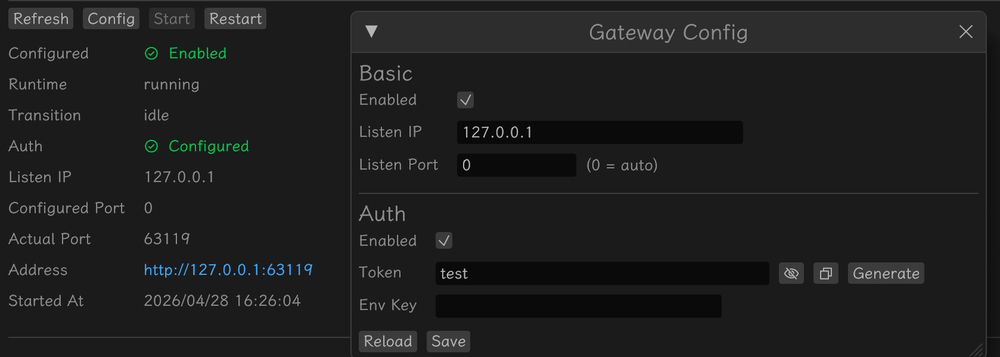

# 通过 WebUI（WebSocket 渠道）使用 Klaw

本教程带你从零开始，通过 Klaw Gateway 的 WebSocket 端点接入 WebUI，在浏览器中与 Agent 进行实时流式对话。每一步中我们会解释配置字段的含义，帮助你理解为什么这样填。

---

## 前置准备

开始配置前，请确认你已具备以下条件：

1. **Klaw 已安装**——通过 `klaw gui` 或 `klaw tui` 启动过一次，`~/.klaw/config.toml` 已自动创建
2. **模型 Provider 已配置**——至少有一个活跃的模型 Provider（参考 [Quick Start](./quick_start.md) 完成 Provider 配置）
3. **浏览器**——Chrome / Firefox / Safari 等现代浏览器

> 如果你还没有配置模型 Provider，请先完成 [Quick Start](./quick_start.md) 的第一步，再回到本教程继续。

---

## 第一步：启用并配置 Gateway

Gateway 是 Klaw 提供的基于 `axum` 的 HTTP 服务，它暴露 WebSocket 聊天端点和可选的 Webhook 输入端点。WebUI 通过 Gateway 的 `/ws/chat` 端点连接后端，因此必须先启用 Gateway。

在 Klaw GUI 的「网关」面板中配置 Gateway 参数：



### 必填项

**Enabled**——勾选后，`klaw gui` 启动时会自动拉起内置 Gateway 服务。不勾选则 Gateway 不启动，WebUI 无法连接。

**Listen IP**——Gateway 监听的 IP 地址，决定哪些网络可以访问：

| 场景 | 填值 | 说明 |
|------|------|------|
| 仅本机访问 | `127.0.0.1` | 默认值，最安全 |
| 同局域网访问 | `0.0.0.0` | 允许局域网内其他设备通过浏览器访问 |

> 如果你只在本机浏览器访问 WebUI，保持默认 `127.0.0.1` 即可。如果需要手机、同事电脑等局域网设备访问，改为 `0.0.0.0`。

**Listen Port**——Gateway 监听端口：

| 填值 | 说明 |
|------|------|
| `0` | 由系统随机分配可用端口，实际端口显示在 Gateway 面板和日志中 |
| `18080` | 固定端口，方便记忆和书签收藏 |
| `3000` | 固定端口，常见开发端口 |

> 推荐填 `0`（随机端口），避免端口冲突。如果你需要固定端口便于配置书签或反向代理，可填写具体数值如 `18080`。

### 认证配置（推荐开启）

**Auth Enabled**——是否启用连接鉴权。强烈建议开启，否则任何知道地址的人都能连接你的 Agent。

**Token**——鉴权令牌字符串。浏览器连接 WebSocket 时需携带此令牌。填写一个足够长的随机字符串，例如：

```bash
# 生成随机令牌（终端执行）
openssl rand -hex 32
```

**Env Key**——令牌的环境变量名，如 `KLAW_GATEWAY_TOKEN`。Klaw 启动时从环境变量读取令牌。与 Token 二选一：

- **Token**（推荐）：直接填写令牌字符串，保存在 `~/.klaw/config.toml` 中。使用后建议设置文件权限 `chmod 600 ~/.klaw/config.toml`
- **Env Key**：填写环境变量名，适用于通过终端命令启动的场景

> 令牌解析优先级：`token` > `env_key`。两者都填时优先使用 `token`。

### Tailscale 配置（可选进阶）

如果你需要从公网或远程 Tailscale 网络访问 WebUI，可以配置 Tailscale 集成：

**Mode**——下拉选择 Tailscale 模式：
- `off`：不使用 Tailscale（默认）
- `serve`：仅暴露到 Tailscale 私有网络（需要对方也是你的 Tailnet 成员）
- `funnel`：暴露到公网（任何人可访问，**必须启用 Auth**）

> 初次使用建议保持 `off`。待基本功能验证后，按需启用 Tailscale。详见 [Tailscale 集成](../gateway/tailscale.md)。

### 保存

填写完成后点击 **Save**。Gateway 配置已写入 `~/.klaw/config.toml`。下次启动 `klaw gui` 时 Gateway 会自动拉起。

---

## 第二步：配置 WebSocket 渠道

WebSocket 渠道是 Gateway 与 Klaw Runtime 之间的通信通道。WebUI 的所有交互（创建会话、发送消息、流式接收响应）都通过它完成。

在 Klaw GUI 的「渠道」面板中点击 **添加 WebSocket 渠道**，或直接编辑配置文件。

### 必填项

**ID**——渠道实例标识，参与会话键生成（`websocket:{id}:{session_key}`）。填简短有辨识度的名称，如 `default`、`browser`。

**Enabled**——勾选后该渠道生效。不勾选则 WebUI 连接无法被 Runtime 处理。

### 建议配置的选项

**Stream Output**——勾选后使用流式输出，WebUI 中可以看到模型逐 token 生成的过程，体验更流畅。强烈建议开启。

**Show Reasoning**——勾选后在 WebUI 响应中展示模型推理过程。适用于代码审查、数据分析等需要透明决策的场景。日常使用建议关闭，界面更简洁。

### 多渠道实例（可选）

你可以配置多个独立的 WebSocket 渠道实例，每个实例对应不同的访问控制策略：

```toml
[[channels.websocket]]
id = "browser"
enabled = true
stream_output = true
show_reasoning = false

[[channels.websocket]]
id = "internal"
enabled = true
stream_output = true
show_reasoning = true
```

> 初次配置建议只创建一个渠道实例（如 `id = "default"`），确认功能正常后再按需增加。

### 保存

填写完成后点击 **Save**，确保 **Enabled** 已勾选。

---

## 第三步：启动 Gateway 并访问 WebUI

### 通过 GUI 启动（推荐）

运行 `klaw gui`，如果 Gateway `enabled = true`，Gateway 服务会自动随 GUI 启动。你可以在 GUI 的「网关」面板看到：

- **监听地址**——如 `ws://127.0.0.1:18080/ws/chat`
- **当前连接数**
- **运行状态**

点击面板上的 **Open WebUI** 按钮（或在浏览器地址栏输入监听地址的 HTTP 版本），即可打开 WebUI 页面。

> 当 `listen_port = 0`（随机端口）时，实际端口会在面板和日志中显示。刷新浏览器前注意记录当前端口。

### 通过命令行启动

如果你不使用 GUI，可以单独启动 Gateway：

```bash
klaw gateway
```

启动后日志会输出实际监听地址，例如：

```text
Gateway listening on http://127.0.0.1:18080
WebSocket endpoint: ws://127.0.0.1:18080/ws/chat
```

在浏览器中打开 `http://127.0.0.1:18080` 即可访问 WebUI。

### 作为守护进程运行

将 Gateway 注册为系统用户级服务，开机自启：

```bash
klaw daemon install
klaw daemon status
```

- macOS 使用 `launchd`，Linux 使用 `systemd --user`
- 服务重启后 WebUI 地址不变（使用固定端口时）

如需停止或卸载：

```bash
klaw daemon stop
klaw daemon uninstall
```

---

## 第四步：在 WebUI 中连接并对话

打开浏览器访问 WebUI 后，你会看到连接引导页面。

### 连接建立

1. **输入 Gateway Token**——如果配置了 `gateway.auth.enabled = true`，在 WebUI 的 Token 输入框中填写你配置的令牌字符串
2. **点击 Connect**——WebUI 建立 WebSocket 连接，状态从「Disconnected」变为「Connected」
3. **自动 Bootstrap**——连接成功后 WebUI 自动发送 `workspace.bootstrap` 请求，拉取已有会话列表

> 你也可以通过 URL 参数直接传递令牌：`http://127.0.0.1:18080/?gateway_token=your-token`。这样分享链接即可免输入令牌。

### 创建新会话

连接成功后，左侧边栏显示会话列表。点击 **+ New Chat** 创建新会话：

1. WebUI 发送 `session.create` 请求
2. 服务端返回新会话的 `session_key` 和标题
3. 新会话窗口自动打开，进入对话模式

### 发送消息

在会话窗口底部的输入框中输入内容，点击 **Send** 或按 `Enter` 提交：

1. WebUI 发送 `session.submit` 请求（`stream = true`）
2. 服务端推送 `session.stream.delta` 事件，WebUI 实时渲染增量文本
3. 生成完成后推送 `session.stream.done`，完整响应在 `payload.response` 中

> `Shift+Enter` 可以在输入框中换行，不触发提交。

### 会话管理

| 操作 | 说明 |
|------|------|
| 重命名 | 在侧边栏点击会话标题旁的编辑图标 |
| 删除 | 点击删除图标，确认后 WebUI 发送 `session.delete` |
| 多窗口 | 点击多个会话，它们以浮动窗口并排展示 |
| 拖拽排列 | 窗口可拖动和缩放，自动错开排列 |

### 主题切换

WebUI 支持三种主题：

- **System**——跟随系统深色/浅色
- **Light**——强制浅色
- **Dark**——强制深色

主题选择保存在浏览器 localStorage，刷新后保持。

### 连接保活

WebUI 每隔 30 秒自动发送 `session.ping` 心跳保持连接。如果连接意外断开，页面会显示断连状态，等待用户手动重连。

---

## 配置示例

以下配置可直接写入 `~/.klaw/config.toml`。

### 最简配置：本机访问 + 认证

```toml
model_provider = "openai"

[model_providers.openai]
base_url = "https://api.openai.com/v1"
wire_api = "chat_completions"
default_model = "gpt-4o-mini"
stream = true
api_key = "sk-xxxxxxxx"

[gateway]
enabled = true
listen_ip = "127.0.0.1"
listen_port = 18080

[gateway.auth]
enabled = true
token = "a1b2c3d4e5f6-random-secret-token"

[[channels.websocket]]
id = "default"
enabled = true
stream_output = true
show_reasoning = false
```

启动后在浏览器打开 `http://127.0.0.1:18080/?gateway_token=a1b2c3d4e5f6-random-secret-token` 即可。

### 局域网访问

```toml
[gateway]
enabled = true
listen_ip = "0.0.0.0"
listen_port = 18080

[gateway.auth]
enabled = true
token = "your-secure-token"
```

局域网内其他设备访问 `http://<你的IP>:18080/?gateway_token=your-secure-token`。

> ⚠️ 局域网访问务必开启认证，否则任何同一网络的人都能使用你的 Agent 和 API 配额。

### 随机端口（无固定地址需求）

```toml
[gateway]
enabled = true
listen_ip = "127.0.0.1"
listen_port = 0

[gateway.auth]
enabled = true
token = "your-secret"
```

启动后查看日志或 GUI Gateway 面板获取实际端口。

### DeepSeek + WebUI

```toml
model_provider = "deepseek"

[model_providers.deepseek]
name = "DeepSeek"
base_url = "https://api.deepseek.com/v1"
wire_api = "chat_completions"
default_model = "deepseek-chat"
stream = true
api_key = "sk-xxxxxxxx"

[gateway]
enabled = true
listen_ip = "127.0.0.1"
listen_port = 18080

[gateway.auth]
enabled = true
token = "your-secure-token"

[[channels.websocket]]
id = "default"
enabled = true
stream_output = true
```

### 本地 Ollama + WebUI

```toml
model_provider = "local"

[model_providers.local]
name = "本地 Ollama"
base_url = "http://localhost:11434/v1"
wire_api = "chat_completions"
default_model = "qwen3:8b"
stream = true

[gateway]
enabled = true
listen_ip = "127.0.0.1"
listen_port = 18080

[[channels.websocket]]
id = "default"
enabled = true
stream_output = true
```

> 本地 Ollama 无需 API Key。Ollama 服务需单独启动（`ollama serve`）。

---

## 接入方式对比

| 特性 | Terminal (TUI) | DingTalk | **WebUI (WebSocket)** |
|------|----------------|----------|----------------------|
| 交互方式 | 全屏终端 UI | 钉钉消息 | 浏览器聊天界面 |
| 媒体支持 | 无 | 图片、语音、文件 | 文本（暂不支持图片粘贴） |
| 流式输出 | 支持 | 互动卡片 | 支持（逐 token 渲染） |
| 多会话 | 单会话 | 多会话 | 多窗口并行 |
| 安装要求 | 本机终端 | 钉钉应用 | 浏览器（零安装） |
| 适用场景 | 本地调试、CLI | 企业协作 | 远程访问、跨设备、展示 |

---

## 常见问题

### Gateway 启动后浏览器打不开页面？

1. 检查 Gateway 是否真的在运行——在 GUI「网关」面板查看状态或查看日志
2. 检查浏览器访问地址是否正确——`listen_port = 0` 时需从面板/日志获取实际端口
3. 检查防火墙是否阻止了端口——局域网访问时尤其注意

### WebUI 连接失败或一直显示 Disconnected？

1. 检查 Token 是否正确——`gateway.auth.enabled = true` 时必须提供匹配的令牌
2. 检查 WebSocket 地址是否可达——浏览器控制台（F12）查看网络错误
3. 检查 Gateway 是否正在运行——重启 `klaw gui` 或 `klaw gateway`
4. 如果使用 Tailscale funnel，确认 Tailscale 服务正常

### 如何查看 Gateway 实际监听端口？

- GUI 模式：在「网关」面板中查看
- 命令行模式：查看启动日志中的 `Gateway listening on` 行
- 配置文件：如果 `listen_port` 不是 `0`，直接看配置值

### 认证 Token 忘了怎么办？

查看 `~/.klaw/config.toml` 中的 `[gateway.auth]` 部分：

```bash
cat ~/.klaw/config.toml | grep -A 3 '\[gateway.auth\]'
```

或使用 `klaw config show` 命令查看完整配置。

### WebUI 消息发送后无响应？

1. 确认模型 Provider 已配置且设为活跃——在 GUI「Provider」面板检查
2. 确认 WebSocket 渠道已启用——`channels.websocket[].enabled = true`
3. 确认 API Key 有效——检查 Provider 的密钥和 Base URL
4. 查看 GUI「Logs」面板中的错误信息

### 局域网其他设备无法访问？

1. 确认 `gateway.listen_ip = "0.0.0.0"`（不是 `127.0.0.1`）
2. 确认防火墙允许对应端口入站
3. 确认对方设备使用你电脑的实际 IP 地址（如 `http://192.168.1.100:18080`）

### 如何分享 WebUI 给他人？

1. 配置 `gateway.auth.enabled = true` 并设置 Token
2. 将完整 URL（含 Token）分享：`http://<IP>:<PORT>?gateway_token=<TOKEN>`
3. 对方在浏览器打开链接即可使用（无需安装任何软件）

> ⚠️ 分享链接包含认证令牌，请仅分享给信任的人。令牌泄露意味着他人可以使用你的 Agent 和 API 配额。

### 如何通过公网访问 WebUI？

使用 Tailscale Funnel 模式：

```toml
[gateway.auth]
enabled = true
token = "your-strong-token"

[gateway.tailscale]
mode = "funnel"
```

启用后，Tailscale 会为你的 Gateway 分配公网域名（如 `https://your-machine.tail-name.ts.net`），任何人可通过此地址访问。**必须开启认证**。

详见 [Tailscale 集成](../gateway/tailscale.md)。

---

## 进一步阅读

- [Gateway 模块](../gateway/README.md)——Gateway 配置与协议详细说明
- [WebSocket Channel](../ui/websocket-channel.md)——WebSocket 协议帧定义与客户端实现要点
- [WebUI Architecture](../ui/webui-architecture.md)——WebUI 技术架构、布局设计与数据流
- [配置字段详解](../configration/fields.md)——所有配置字段的完整参考
- [Quick Start](./quick_start.md)——模型 Provider 与 DingTalk 渠道配置教程