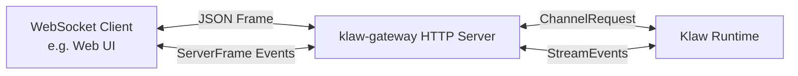

# WebSocket Channel 架构与使用指南

## 概述

WebSocket Channel 是 Klaw 提供的**交互式输入输出通道**，允许第三方客户端（如 Web UI、移动应用、自定义集成）通过 WebSocket 协议连接到 Klaw 服务端，实现完整的会话管理与实时流式对话。

## 核心能力

| 能力 | 说明 |
|------|------|
| **多会话管理** | 支持创建/更新/删除/订阅会话，一个连接可切换多个会话 |
| **实时流式输出** | 支持 SSE 风格的增量流式响应，客户端可逐字渲染 |
| **工作区元数据同步** | 启动时拉取完整会话列表，支持客户端离线缓存 |
| **历史消息拉取** | 订阅会话时自动推送历史消息记录 |
| **标准 JSON 协议** | 基于 JSON 文本帧的请求-响应模型，易于集成 |
| **多连接支持** | 服务端支持并发连接，每个连接独立维护状态 |

## 架构图



**分层职责：**

1. **`klaw-channel::websocket`** - Channel 驱动定义，元数据常量，请求封装
2. **`klaw-gateway::websocket`** - Axum WebSocket 处理器，协议帧编解码
3. **`klaw-runtime::gateway_websocket`** - 运行时处理器，对接 session manager 与 agent
4. **GUI Channel panel** - 配置管理与状态监控

## 协议定义

### 客户端 → 服务端：请求帧格式

所有客户端请求都是 **Method 帧**，格式如下：

```json
{
  "type": "Method",
  "id": "string-request-id",
  "method": "method_name",
  "params": {}
}
```

`id` 用于匹配对应响应，必须唯一。

### 支持的方法（InboundMethod）

| 方法 | 说明 | 必填参数 |
|------|------|----------|
| `session.ping` | 心跳检测 | - |
| `workspace.bootstrap` | 获取工作区会话列表 | - |
| `session.create` | 创建新会话 | - |
| `session.update` | 更新会话标题 | `session_key`, `title` |
| `session.delete` | 删除会话 | `session_key` |
| `session.subscribe` | 订阅会话，并更新默认提交会话 | `session_key` |
| `session.unsubscribe` | 清空当前连接的全部订阅 | - |
| `session.submit` | 提交用户输入获取响应 | `input`, 可选 `session_key`, `chat_id`, `channel_id`, `stream`, `metadata` |

### 服务端 → 客户端：帧类型

#### 1. Result 帧

对客户端请求的成功响应：

```json
{
  "type": "Result",
  "id": "request-id",
  "result": {}
}
```

#### 2. Event 帧

服务器主动推送的事件（用于流式输出、历史消息）：

```json
{
  "type": "Event",
  "event": "event_name",
  "payload": {}
}
```

#### 3. Error 帧

请求处理失败：

```json
{
  "type": "Error",
  "id": "request-id",
  "error": {
    "code": "error_code",
    "message": "human readable message",
    "data": {}
  }
}
```

### 服务端事件（OutboundEvent）

| 事件 | 触发时机 | 负载 |
|------|----------|------|
| `session.connected` | 连接建立完成 | `connection_id`, `session_key` |
| `session.subscribed` | 会话订阅完成 | `session_key` |
| `session.unsubscribed` | 会话取消订阅 | `session_key` |
| `session.message` | 推送消息（历史或新增）| `session_key`, `role`, `response.content`, `response.metadata`, `timestamp_ms`, `message_id`, `history` |
| `session.stream.clear` | 清除上次流式响应占位 | `session_key` |
| `session.stream.delta` | 流式响应增量 | `session_key`, `delta`, `done` |
| `session.stream.done` | 流式响应完成 | `session_key`, `response` |

## 使用示例

### 连接建立

```javascript
const ws = new WebSocket('ws://localhost:3000/api/gateway/ws');

ws.onopen = () => {
  console.log('Connected');
};

ws.onmessage = (event) => {
  const frame = JSON.parse(event.data);
  handleFrame(frame);
};
```

### Bootstrap 获取会话列表

```javascript
// 请求
sendFrame({
  type: 'Method',
  id: uuid(),
  method: 'workspace.bootstrap',
  params: {}
});

// 响应 Result
{
  "type": "Result",
  "id": "...",
  "result": {
    "sessions": [
      {
        "session_key": "uuid",
        "title": "My Chat",
        "created_at_ms": 1712800000000
      }
    ],
    "active_session_key": "uuid"
  }
}
```

### 创建新会话

```javascript
// 请求
sendFrame({
  type: 'Method',
  id: uuid(),
  method: 'session.create',
  params: {}
});

// 响应 Result
{
  "type": "Result",
  "id": "...",
  "result": {
    "session_key": "new-uuid",
    "title": "New Chat",
    "created_at_ms": 1712800000000
  }
}
```

### 订阅会话并发送提问

```javascript
// 先订阅
sendFrame({
  type: 'Method',
  id: uuid(),
  method: 'session.subscribe',
  params: { session_key: 'my-session-key' }
});

// 订阅后会推送该会话的历史消息作为 session.message 事件，
// 并把该会话加入当前连接的实时订阅集合。
// 历史与实时消息都会放在 payload.response 下

// 发送提问
sendFrame({
  type: 'Method',
  id: uuid(),
  method: 'session.submit',
  params: {
    input: 'Explain Rust borrow checker',
    stream: true
  }
});

// 接收流式响应
// 1. session.stream.clear (可选，清除上一个响应占位)
// 2. 多个 session.stream.delta 增量推送
onEvent('session.stream.delta', (payload) => {
  appendToOutput(payload.delta);
});
// 3. session.stream.done 标记完成，完整快照在 payload.response 中
onEvent('session.stream.done', (payload) => {
  finalizeResponse(payload.response.content);
});
```

### Ping/Pong 心跳

```javascript
// 客户端发送 ping
sendFrame({
  type: 'Method',
  id: uuid(),
  method: 'session.ping',
  params: {}
});

// 服务端响应
{
  "type": "Result",
  "id": "...",
  "result": { "ok": true }
}
```

## 配置说明

在 `klaw.toml` 中配置：

```toml
[channels.websocket.default]
enabled = true
show_reasoning = false
stream_output = true
```

| 配置项 | 类型 | 默认 | 说明 |
|--------|------|------|------|
| `id` | string | `"default"` | Channel 实例 ID |
| `enabled` | bool | `true` | 是否启用 |
| `show_reasoning` | bool | `false` | 是否在响应中包含推理过程 |
| `stream_output` | bool | `true` | 是否使用流式输出 |

可以配置**多个独立的 WebSocket Channel 实例**，每个实例对应不同的访问控制或配置：

```toml
[channels.websocket.client_a]
enabled = true
show_reasoning = false

[channels.websocket.client_b]
enabled = true
show_reasoning = true
```

## 数据流详解

### 非流式输出（stream = false）

```
Client -> session.submit -> Gateway -> Runtime -> Agent -> ChannelResponse
    -> Gateway -> Result (full response) -> Client
```

### 流式输出（stream = true）

```
Client -> session.submit -> Gateway -> Runtime -> Agent
    -> Agent generates delta 1 -> Event session.stream.delta -> Client
    -> Agent generates delta 2 -> Event session.stream.delta -> Client
    -> ...
    -> Agent completes -> Event session.stream.done -> Client
```

### 元数据传递

WebSocket Channel 会在 `ChannelRequest` metadata 中注入以下键：

| Key | Value |
|-----|-------|
| `channel.websocket.connection_id` | 连接 UUID |
| `channel.websocket.channel_id` | Channel 实例 ID |
| `channel.websocket.request_id` | 请求 ID |

下游技能/工具可以读取这些元数据用于日志追踪。

## GUI 面板功能

Channel 面板（`Channel`）提供：

1. **实例列表** - 显示所有已配置的 WebSocket Channel
2. **状态监控** - 显示当前运行状态（Running/Stopped）
3. **配置编辑** - 直接在 GUI 中修改 `enabled`/`show_reasoning`/`stream_output`
4. **启停控制** - 支持动态启停 Channel 实例

## 错误码参考

| 错误码 | 场景 |
|--------|------|
| `invalid_json` | 客户端发送的 JSON 解析失败 |
| `unknown_method` | 不支持的 method |
| `invalid_params` | 参数解析失败或必填字段缺失 |
| `not_configured` | Gateway WebSocket handler 未配置 |
| `missing_session` | `session.submit` 没有有效的 `session_key` |
| `internal_error` | 服务端内部错误 |
| `invalid_message_type` | 发送了 Binary 消息（仅支持 Text） |

## 实现位置

| 模块 | 文件 | 职责 |
|------|------|------|
| `klaw-channel` | `websocket.rs` | Channel 驱动、请求封装、元数据常量 |
| `klaw-channel` | `lib.rs` | `SessionChannel::Websocket` 枚举定义 |
| `klaw-gateway` | `websocket.rs` | Axum WebSocket 连接处理、协议帧编解码 |
| `klaw-runtime` | `gateway_websocket.rs` | 运行时处理、对接 session manager |
| `klaw-gui` | `panels/channel.rs` | GUI 配置面板 |
| `klaw-config` | `lib.rs` | `WebsocketConfig` 配置结构 |

## 客户端实现要点

1.** Ping 保活 **: 建议客户端每 30 秒发送一次 `session.ping` 保持连接
2.** 重连机制 **: 连接断开后应使用指数退避重连，恢复需要接收实时消息的全部订阅会话
3.** 增量渲染**: 流式输出需要做 DOM 增量更新，避免全量重绘影响性能
4.** 请求 ID 唯一性**: 使用 UUID v4 保证请求 ID 唯一

## 常见问题

**Q: 一个连接可以同时处理多个会话吗？**

A: 可以。一个连接可以连续调用 `session.subscribe` 订阅多个会话，并接收这些会话各自的实时消息；最近一次 `session.subscribe` 会更新默认提交会话，供未显式携带 `session_key` 的 `session.submit` 回退使用。

**Q: 支持二进制消息吗？**

A: 当前仅支持文本 JSON 帧，不支持二进制帧。媒体资源通过 MediaReference 以 URL 形式传递。

**Q: 如何认证客户端？**

A: 认证由 klaw-gateway 的上层 HTTP 中间件处理，WebSocket 握手阶段完成认证。
