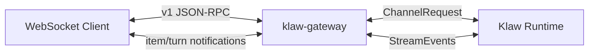

# WebSocket Channel 架构与使用指南

## 概述

WebSocket Channel 是 Klaw 提供的交互式输入输出通道。客户端通过 Gateway WebSocket v1 JSON-RPC 协议连接 `/ws/chat`，完成会话管理、历史读取、结构化 turn 提交和实时 `item/*` / `turn/*` 通知消费。

旧版 `type: "method" | "result" | "event" | "error"` 帧已移除；新客户端必须使用 v1 envelope。

## 核心能力

| 能力 | 说明 |
|------|------|
| 多会话管理 | 支持创建、更新、删除、订阅会话，一个连接可订阅多个会话 |
| 实时流式输出 | 通过 `item/agentMessage/delta` 增量通知驱动客户端渲染 |
| 工作区元数据同步 | 通过 `session/list` 拉取会话列表和当前 active session |
| 历史消息拉取 | 通过 `thread/history` 分页读取持久化聊天记录 |
| 结构化输入 | `turn/start` 使用 content blocks 表达文本、图片和附件 |
| 多连接支持 | 服务端按连接维护订阅集合和 active turn 状态 |

## 架构


```mermaid
flowchart LR
    Client[WebSocket Client] <-->|v1 JSON-RPC| Gateway[klaw-gateway]
    Gateway <-->|ChannelRequest| Runtime[Klaw Runtime]
    Runtime <-->|StreamEvents| Gateway
    Gateway <-->|item/turn notifications| Client
```

## 协议

客户端请求：

```json
{ "id": "req_1", "method": "turn/start", "params": {} }
```

服务端成功响应：

```json
{ "id": "req_1", "result": {} }
```

服务端错误响应：

```json
{ "id": "req_1", "error": { "code": "invalid_params", "message": "..." } }
```

服务端通知：

```json
{ "method": "item/agentMessage/delta", "params": {} }
```

常用方法：

| 方法 | 说明 |
|------|------|
| `initialize` / `initialized` | 协议初始化和能力协商 |
| `session/list` | 获取工作区会话列表 |
| `session/create` | 创建新会话 |
| `session/update` | 更新会话标题 |
| `session/delete` | 删除会话 |
| `session/subscribe` | 订阅会话并更新默认提交会话 |
| `session/unsubscribe` | 清空当前连接的全部订阅 |
| `provider/list` | 获取可选模型 provider |
| `thread/history` | 分页读取会话历史 |
| `turn/start` | 提交结构化用户输入 |
| `turn/cancel` | 取消当前连接中已追踪的 turn |

常用通知：

| 通知 | 说明 |
|------|------|
| `session/subscribed` | 会话订阅完成 |
| `session/unsubscribed` | 会话取消订阅 |
| `turn/started` | turn 已被服务端接受并开始处理 |
| `item/completed` (`userMessage`) | 用户消息已被服务端接受并广播 |
| `item/started` | agent message item 开始 |
| `item/agentMessage/delta` | agent message 增量 |
| `item/completed` | item 完成 |
| `turn/completed` | turn 完成 |
| `turn/failed` | turn 失败 |
| `turn/interrupted` | turn 被取消或中断 |

## 使用示例

```javascript
const ws = new WebSocket('ws://localhost:3000/ws/chat');

ws.onopen = () => {
  sendRpc('init-1', 'initialize', {
    client_info: { name: 'example-client' },
    capabilities: { protocol_version: 'v1', turns: true, items: true }
  });
  sendNotification('initialized', {});
  sendRpc('sessions-1', 'session/list', {});
};

function sendRpc(id, method, params) {
  ws.send(JSON.stringify({ id, method, params }));
}

function sendNotification(method, params) {
  ws.send(JSON.stringify({ method, params }));
}

function startTurn(sessionId, text) {
  sendRpc(crypto.randomUUID(), 'turn/start', {
    session_id: sessionId,
    thread_id: sessionId,
    input: [{ type: 'text', text }]
  });
}
```

## 配置

在 `config.toml` 中配置：

```toml
[[channels.websocket]]
id = "default"
enabled = true
show_reasoning = false
stream_output = true
```

| 配置项 | 类型 | 默认 | 说明 |
|--------|------|------|------|
| `id` | string | `"default"` | Channel 实例 ID |
| `enabled` | bool | `true` | 是否启用 |
| `show_reasoning` | bool | `false` | 是否在响应中包含推理过程 |
| `stream_output` | bool | `true` | 是否使用流式输出 |

## 数据流

```text
Client turn/start
  -> Gateway validates v1 frame and tracks active turn
  -> Gateway emits item/completed userMessage to subscribed clients
  -> Runtime converts content blocks to ChannelRequest
  -> Agent emits stream snapshots
  -> Gateway emits item/agentMessage/delta
  -> Gateway emits item/completed and turn/completed
```

## 实现位置

| 模块 | 文件 | 职责 |
|------|------|------|
| `klaw-channel` | `websocket.rs` | Channel 请求封装和 metadata 常量 |
| `klaw-gateway` | `websocket.rs` / `protocol.rs` | WebSocket 连接处理、v1 协议类型、帧编解码 |
| `klaw-runtime` | `gateway_websocket.rs` | runtime 对接 session manager 与 agent |
| `klaw-gui` | `panels/channel.rs` | GUI 配置面板 |
| `klaw-config` | `lib.rs` | `WebsocketConfig` 配置结构 |

## 客户端实现要点

1. 连接后先发送 `initialize`，再发送 `initialized`。
2. 使用 UUID v4 生成请求 ID。
3. 断线重连后重新执行 `session/list`，并恢复需要实时消息的订阅。
4. 使用 `turn/start` 的 `session_id` 和 `thread_id` 明确目标会话。
5. 对 `too_many_active_turns`、`payload_too_large` 等错误实现重试或用户提示。
